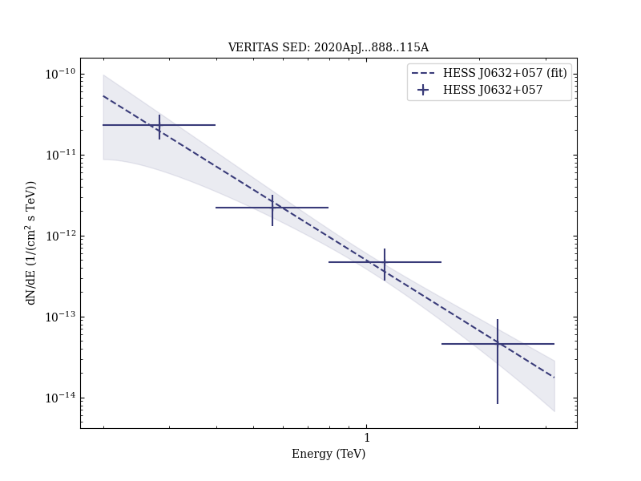
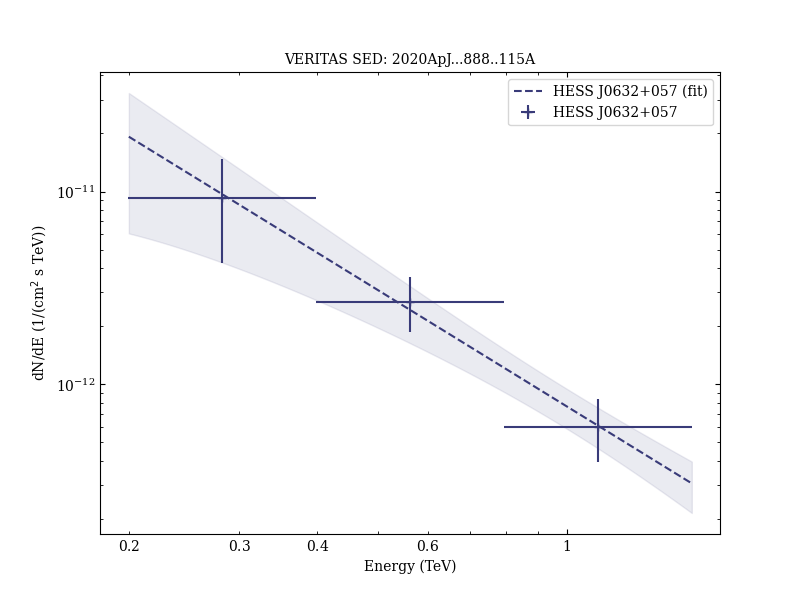

# Probing the Properties of the Pulsar Wind in the Gamma-Ray Binary HESS J0632+057 with NuSTAR and VERITAS Observations

Reference:
Archer, A. et al. (The VERITAS Collaboration), The Astrophysical Journal, 888, 115 (2020)

- ADS: [2020ApJ...888..115A](http://adsabs.harvard.edu/abs/2020ApJ...888..115A)
- DOI: [10.3847/1538-4357/ab59de](https://doi.org/10.3847/1538-4357/ab59de)

## HESS J0632+057 (VER J0633+057)
### Data files

- observation data: [VER-000030-1.yaml](VER-000030-1.yaml)  [VER-000030-2.yaml](VER-000030-2.yaml)
- spectral data: [VER-000030-sed-1.ecsv](VER-000030-sed-1.ecsv)  [VER-000030-sed-2.ecsv](VER-000030-sed-2.ecsv)
- observation data and fit results: [VER-000030-1.yaml](VER-000030-1.yaml)  [VER-000030-2.yaml](VER-000030-2.yaml)

### Figures

