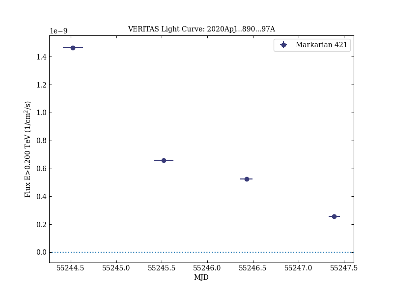
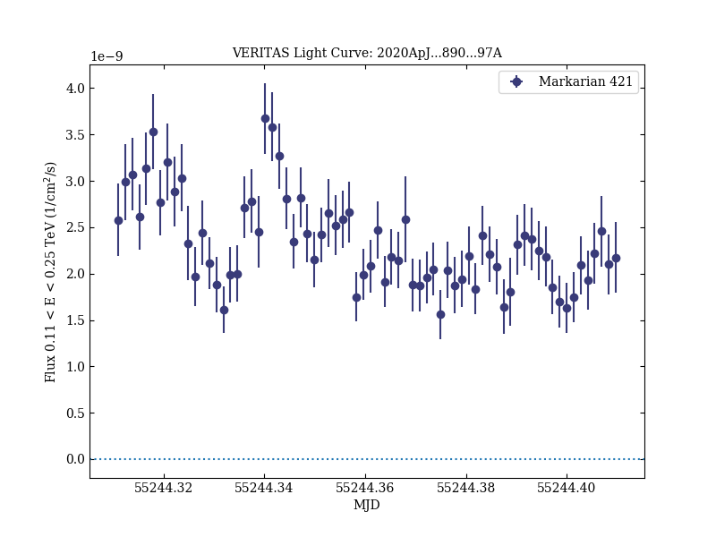
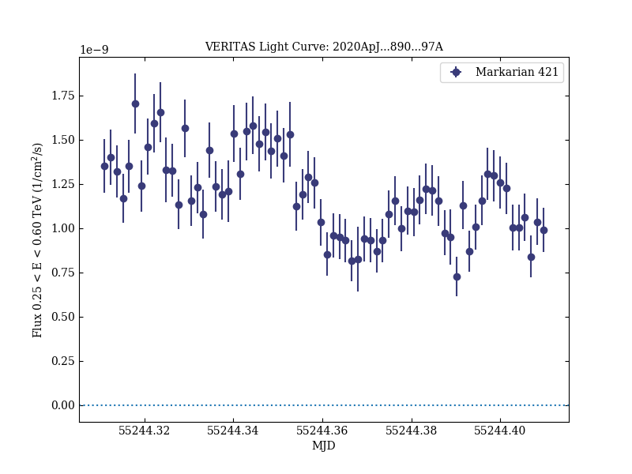
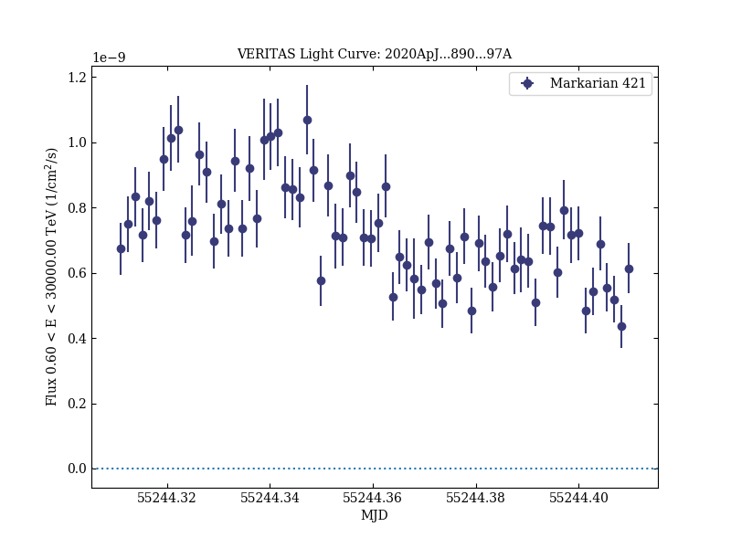
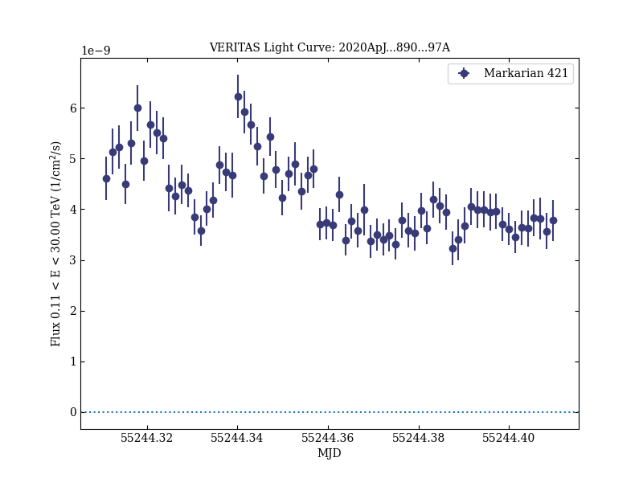
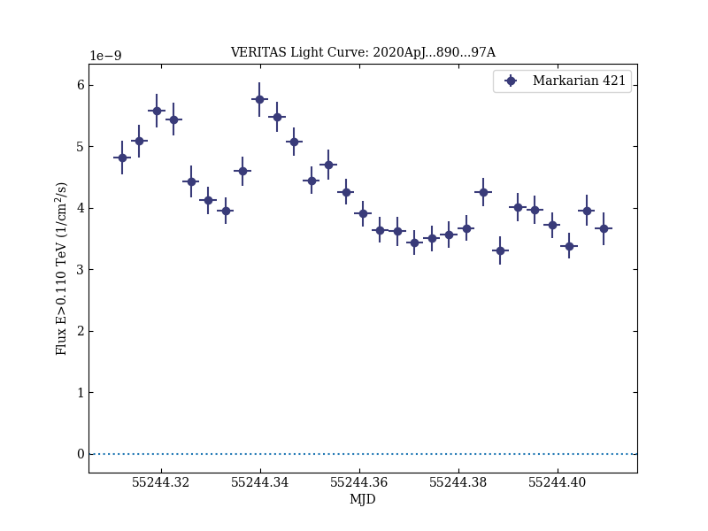
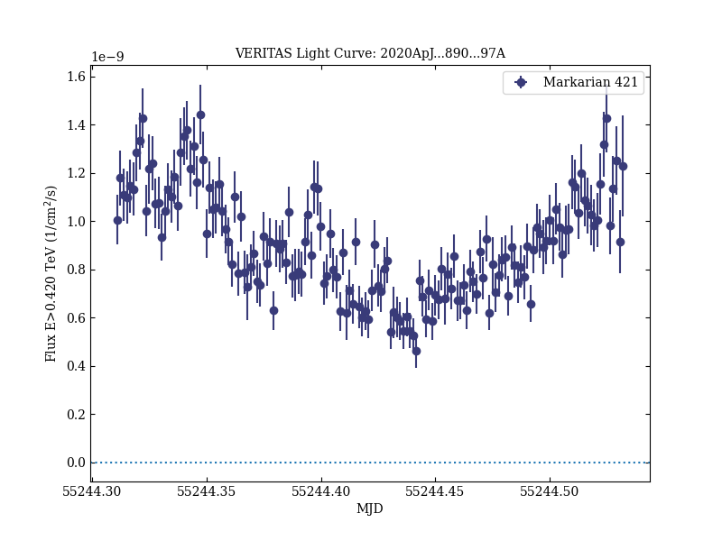
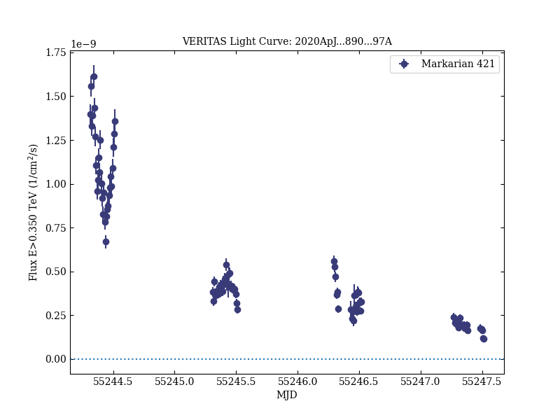

# The Great Markarian 421 Flare of 2010 February: Multiwavelength Variability and Correlation Studies

Reference:
Abeysekara, A. U. et al. (The VERITAS Collaboration), The Astrophysical Journal, 890, 97 (2020)

- ADS: [2020ApJ...890...97A](http://adsabs.harvard.edu/abs/2020ApJ...890...97A)
- DOI: [10.3847/1538-4357/ab6612](https://doi.org/10.3847/1538-4357/ab6612)

## Markarian 421 (VER J1104+382)
### Data files

- observation data: [VER-000049-1.yaml](VER-000049-1.yaml)
- light-curve data: [VER-000049-lc-1.ecsv](VER-000049-lc-1.ecsv)  [VER-000049-lc-2.ecsv](VER-000049-lc-2.ecsv)  [VER-000049-lc-3.ecsv](VER-000049-lc-3.ecsv)  [VER-000049-lc-4.ecsv](VER-000049-lc-4.ecsv)  [VER-000049-lc-5.ecsv](VER-000049-lc-5.ecsv)  [VER-000049-lc-6.ecsv](VER-000049-lc-6.ecsv)  [VER-000049-lc-7.ecsv](VER-000049-lc-7.ecsv)  [VER-000049-lc-8.ecsv](VER-000049-lc-8.ecsv)
- observation data and fit results: [VER-000049-1.yaml](VER-000049-1.yaml)

### Figures

