# A Decade of Multiwavelength Observations of the TeV Blazar 1ES 1215+303: Extreme Shift of the Synchrotron Peak Frequency and Long-term Optical-Gamma-Ray Flux Increase

Reference:
Valverde, Janeth et al. (The VERITAS Collaboration), The Astrophysical Journal, 891, 170 (2020)

- ADS: [2020ApJ...891..170V](http://adsabs.harvard.edu/abs/2020ApJ...891..170V)
- DOI: [10.3847/1538-4357/ab765d](https://doi.org/10.3847/1538-4357/ab765d)

### Data tables

- data tables: [VER-000053-spectralFits-table-1.ecsv](VER-000053-spectralFits-table-1.ecsv)  
## 1ES 1215+303 (VER J1217+301)
### Data files

- observation data: [VER-000053-1.yaml](VER-000053-1.yaml)  
- spectral data: [VER-000053-sed-1.ecsv](VER-000053-sed-1.ecsv)  [VER-000053-sed-2.ecsv](VER-000053-sed-2.ecsv)  [VER-000053-sed-3.ecsv](VER-000053-sed-3.ecsv)  [VER-000053-sed-4.ecsv](VER-000053-sed-4.ecsv)  [VER-000053-sed-5.ecsv](VER-000053-sed-5.ecsv)  [VER-000053-sed-6.ecsv](VER-000053-sed-6.ecsv)  [VER-000053-sed-7.ecsv](VER-000053-sed-7.ecsv)  [VER-000053-sed-8.ecsv](VER-000053-sed-8.ecsv)  [VER-000053-sed-9.ecsv](VER-000053-sed-9.ecsv)  [VER-000053-sed-10.ecsv](VER-000053-sed-10.ecsv)  [VER-000053-sed-11.ecsv](VER-000053-sed-11.ecsv)  [MW-000053-sed-1.ecsv](MW-000053-sed-1.ecsv)  [MW-000053-sed-2.ecsv](MW-000053-sed-2.ecsv)  [MW-000053-sed-3.ecsv](MW-000053-sed-3.ecsv)  
- light-curve data: [VER-000053-lc-1.ecsv](VER-000053-lc-1.ecsv)  [VER-000053-lc-2.ecsv](VER-000053-lc-2.ecsv)  [VER-000053-lc-3.ecsv](VER-000053-lc-3.ecsv)  [VER-000053-lc-4.ecsv](VER-000053-lc-4.ecsv)  [VER-000053-lc-5.ecsv](VER-000053-lc-5.ecsv)  
- observation data and fit results: [VER-000053-1.yaml](VER-000053-1.yaml)  

### Figures

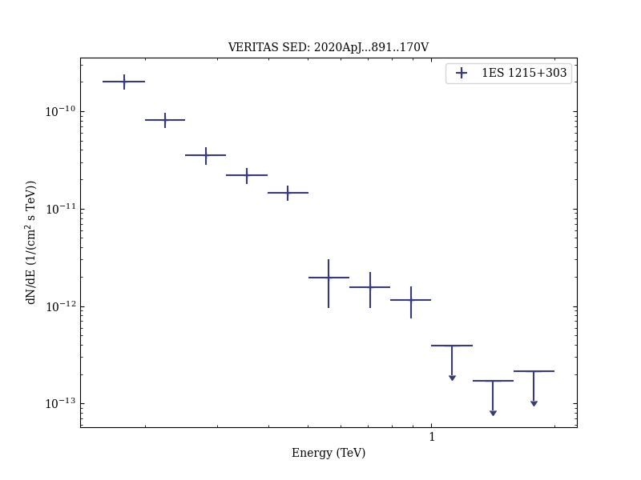
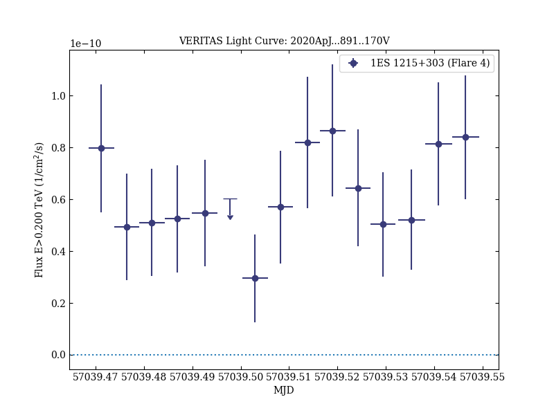
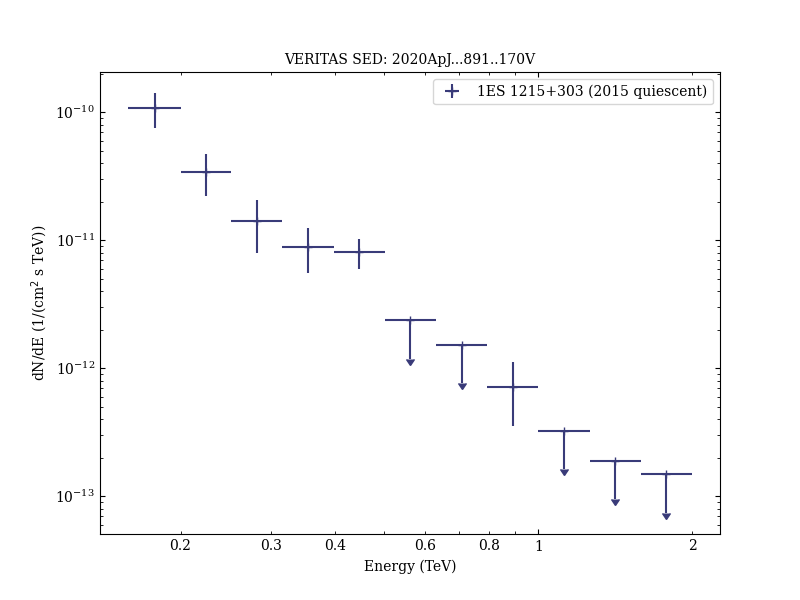
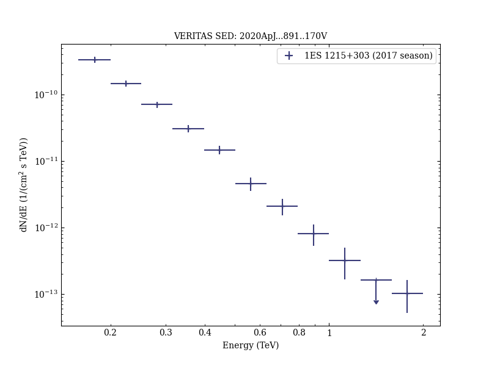
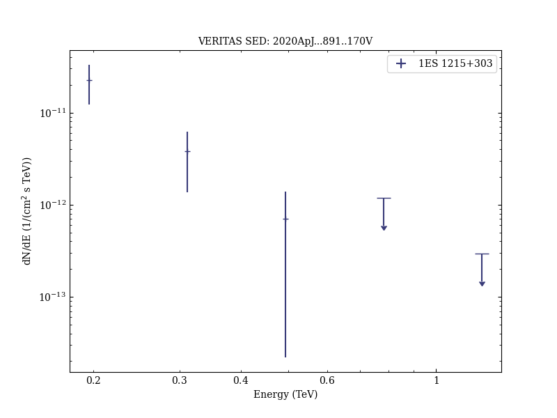
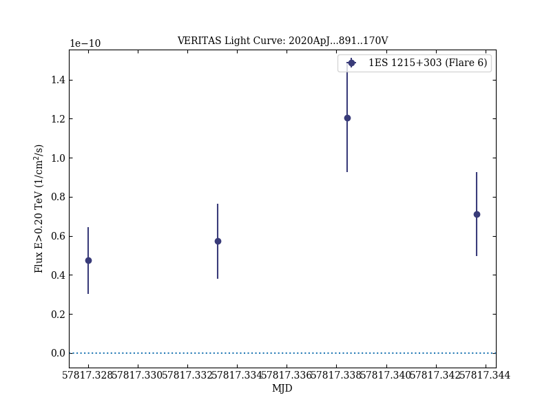

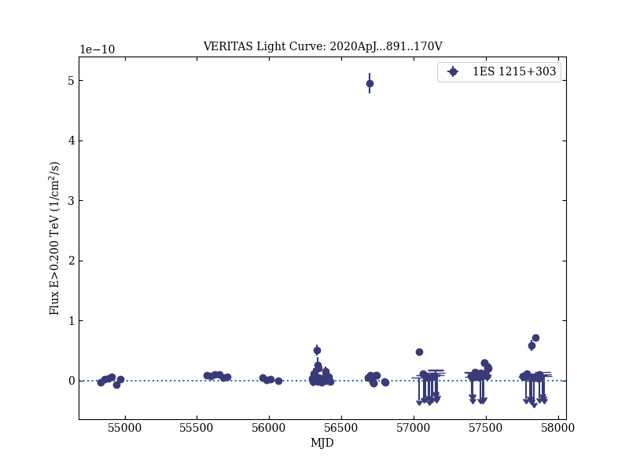
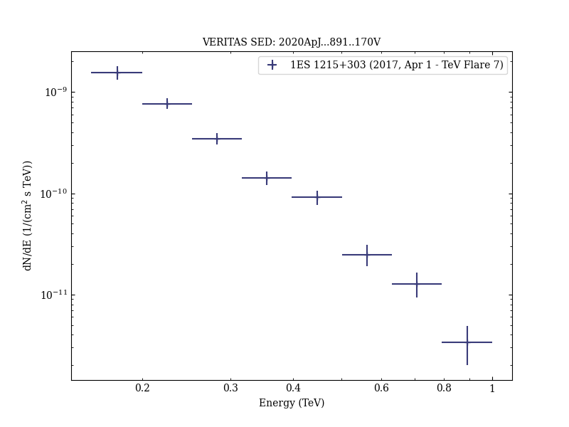
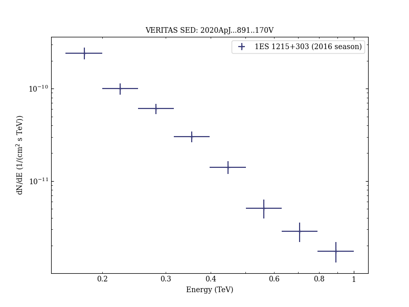
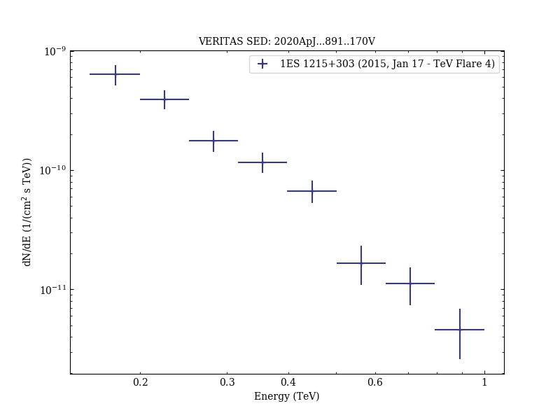
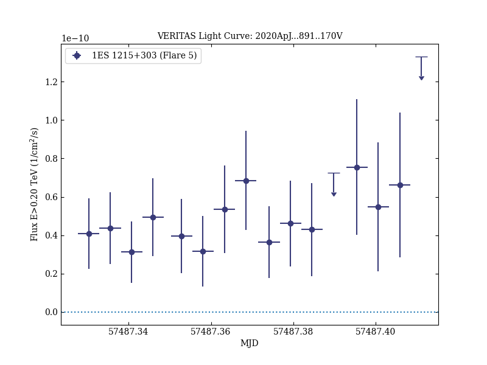
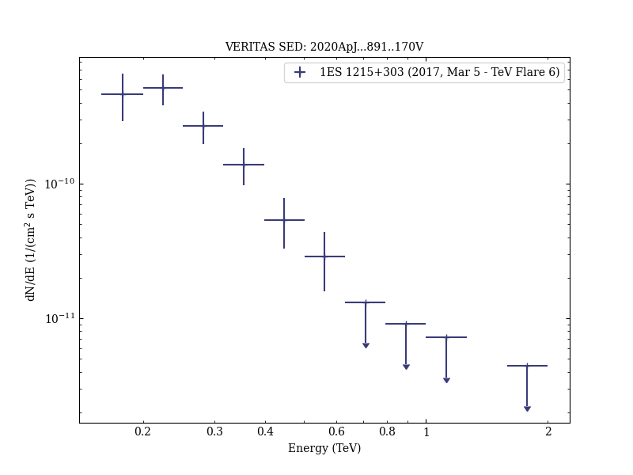
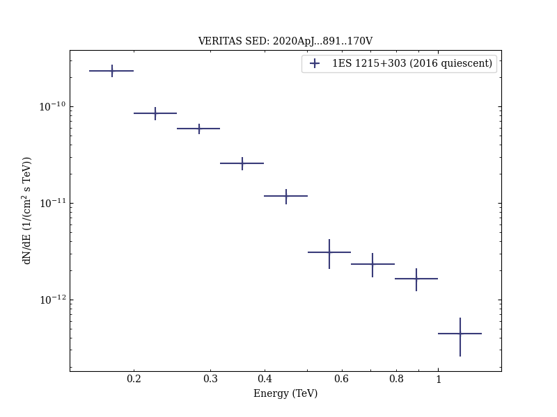
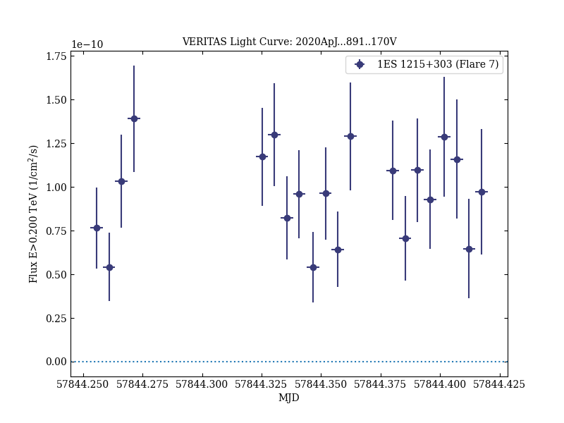
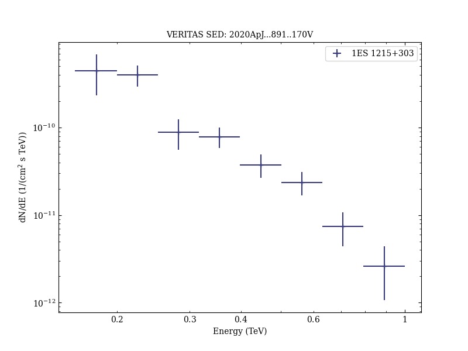

