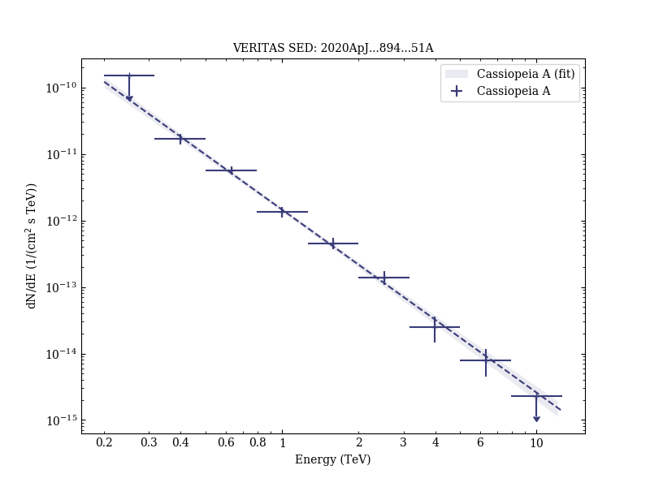

# 

Reference:
, The Astrophysical Journal,  

- ADS: [2020ApJ...894...51A](http://adsabs.harvard.edu/abs/2020ApJ...894...51A)
## Cassiopeia A
### Data files

- observation data: [VER-000153-1.yaml](VER-000153-1.yaml)  
- spectral data: [VER-000153-sed-1.ecsv](VER-000153-sed-1.ecsv)  
- observation data and fit results: [VER-000153-1.yaml](VER-000153-1.yaml)  
- FITS data: [VER-000153-excess-skymap.fits](VER-000153-excess-skymap.fits)  

### Figures

