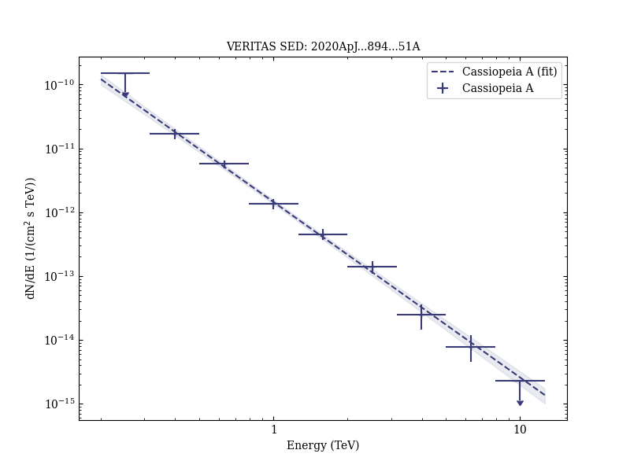

# Evidence for Proton Acceleration up to TeV Energies Based on VERITAS and Fermi-LAT Observations of the Cas A SNR

Reference:
Abeysekara, A. U. et al. (The VERITAS Collaboration), The Astrophysical Journal, 894, 51 (2020)

- ADS: [2020ApJ...894...51A](http://adsabs.harvard.edu/abs/2020ApJ...894...51A)
- DOI: [10.3847/1538-4357/ab8310](https://doi.org/10.3847/1538-4357/ab8310)

## Cassiopeia A (VER J2323+588)
### Data files

- observation data: [VER-000153-1.yaml](VER-000153-1.yaml)
- spectral data: [VER-000153-sed-1.ecsv](VER-000153-sed-1.ecsv)
- observation data and fit results: [VER-000153-1.yaml](VER-000153-1.yaml)
- FITS data: [VER-000153-excess-skymap.fits](VER-000153-excess-skymap.fits)

### Figures

