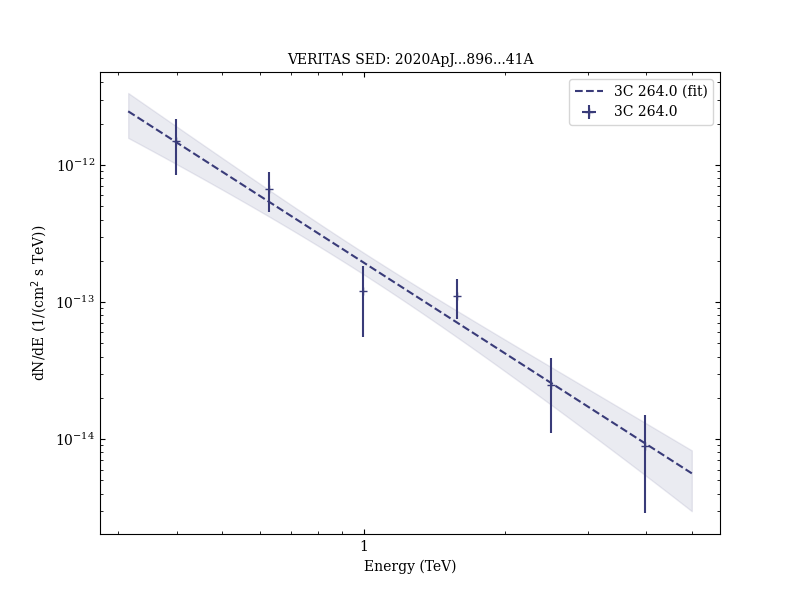
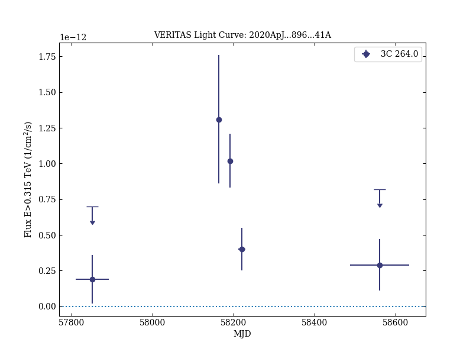

# VERITAS Discovery of VHE Emission from the Radio Galaxy 3C 264: A Multiwavelength Study

Reference:
Archer, A. et al. (The VERITAS Collaboration), The Astrophysical Journal, 896, 41 (2020)

- ADS: [2020ApJ...896...41A](http://adsabs.harvard.edu/abs/2020ApJ...896...41A)
- DOI: [10.3847/1538-4357/ab910e](https://doi.org/10.3847/1538-4357/ab910e)

## 3C 264.0 (VER J1145+196)
### Data files

- observation data: [VER-000173-1.yaml](VER-000173-1.yaml)  [VER-000173-2.yaml](VER-000173-2.yaml)  
- spectral data: [VER-000173-sed-2.ecsv](VER-000173-sed-2.ecsv)  
- light-curve data: [VER-000173-lc.ecsv](VER-000173-lc.ecsv)  
- observation data and fit results: [VER-000173-1.yaml](VER-000173-1.yaml)  [VER-000173-2.yaml](VER-000173-2.yaml)  

### Figures

