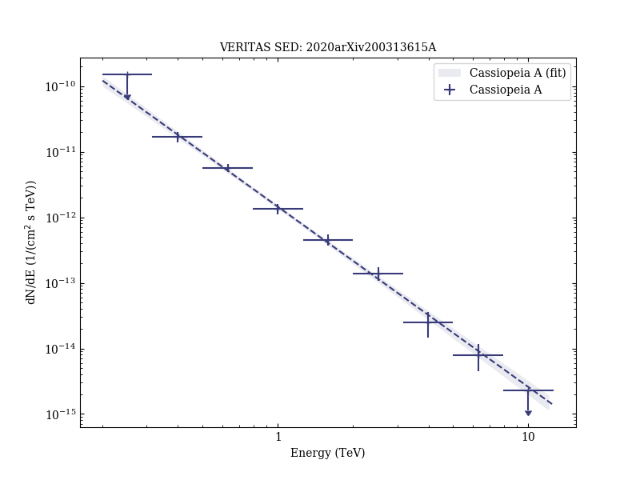

# Evidence for proton acceleration up to TeV energies based on VERITAS and Fermi-LAT observations of the Cas A SNR

Reference:
Abeysekara, A. U. et al. (The VERITAS Collaboration), arXiv:2003.13615 (2020)

- ADS: [2020arXiv200313615A](http://adsabs.harvard.edu/abs/2020arXiv200313615A)
## Cassiopeia A
### Data files

- observation data: [VER-000153-1.yaml](VER-000153-1.yaml)  
- spectral data: [VER-000153-sed-1.ecsv](VER-000153-sed-1.ecsv)  
- observation data and fit results: [VER-000153-1.yaml](VER-000153-1.yaml)  
- FITS data: [VER-000153-excess-skymap.fits](VER-000153-excess-skymap.fits)  

### Figures

