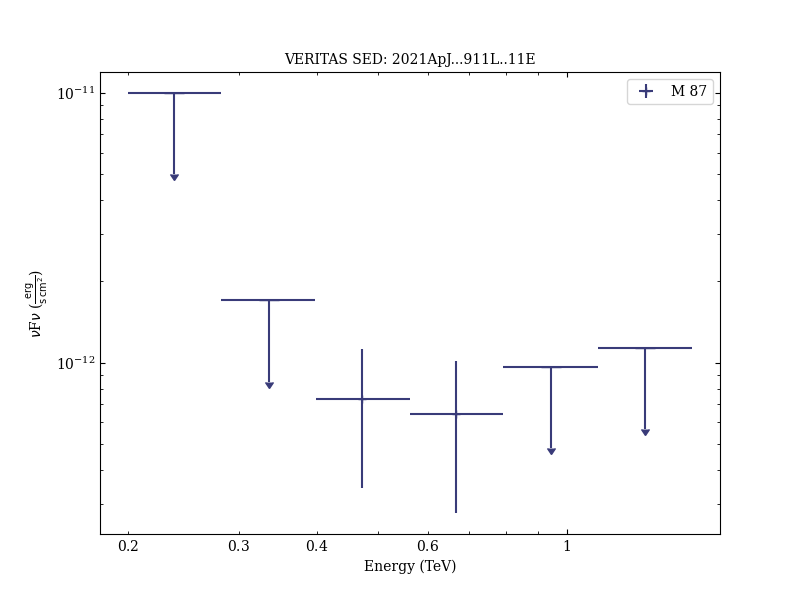
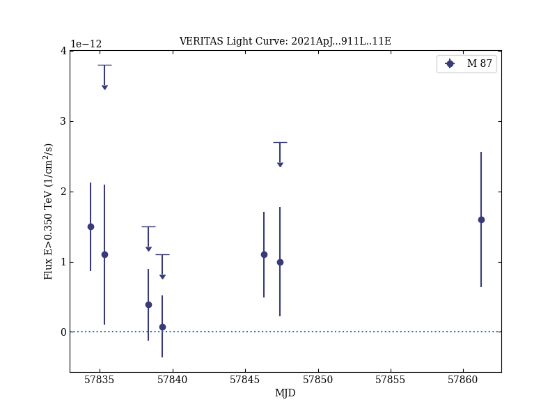

# Broadband Multi-wavelength Properties of M87 during the 2017 Event Horizon Telescope Campaign

Reference:
EHT MWL Science Working Group et al. (The VERITAS, HESS, MAGIC, and EAVN Collaborations), The Astrophysical Journal, 911, L11 (2021)

- ADS: [2021ApJ...911L..11E](http://adsabs.harvard.edu/abs/2021ApJ...911L..11E)
- DOI: [10.3847/2041-8213/abef71](https://doi.org/10.3847/2041-8213/abef71)

## M 87 (VER J1230+123)
### Data files

- observation data: [VER-000058.yaml](VER-000058.yaml)  
- spectral data: [VER-000058-sed-1.ecsv](VER-000058-sed-1.ecsv)  
- light-curve data: [VER-000058-lc-1.ecsv](VER-000058-lc-1.ecsv)  
- observation data and fit results: [VER-000058.yaml](VER-000058.yaml)  

### Figures

