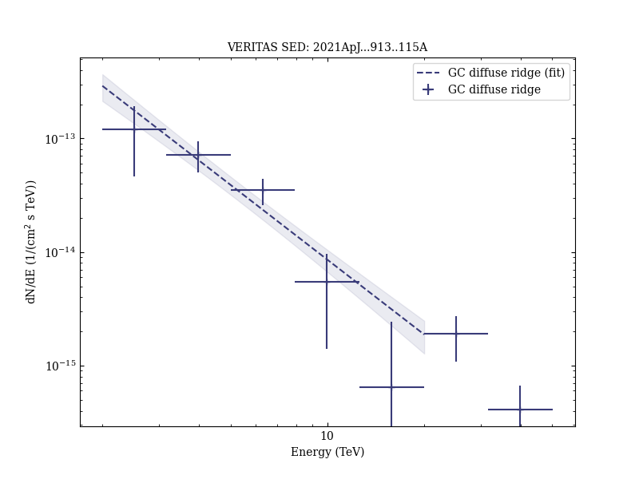

# VERITAS Observations of the Galactic Center Region at Multi-TeV Gamma-Ray Energies

Reference:
Adams, C. B. et al. (The VERITAS Collaboration), The Astrophysical Journal, 913, 115 (2021)

- ADS: [2021ApJ...913..115A](http://adsabs.harvard.edu/abs/2021ApJ...913..115A)
- DOI: [10.3847/1538-4357/abf926](https://doi.org/10.3847/1538-4357/abf926)

## Galactic Centre (VER J1745-290)
### Data files

- observation data: [VER-000106-1.yaml](VER-000106-1.yaml)  
- spectral data: [VER-000106-sed.ecsv](VER-000106-sed.ecsv)  
- light-curve data: [VER-000106-lc-1.ecsv](VER-000106-lc-1.ecsv)  [VER-000106-lc-2.ecsv](VER-000106-lc-2.ecsv)  [VER-000106-lc-3.ecsv](VER-000106-lc-3.ecsv)  
- observation data and fit results: [VER-000106-1.yaml](VER-000106-1.yaml)  
- FITS data: [VER-000106-excess-skymap.fits](VER-000106-excess-skymap.fits)  [VER-000106-signif-skymap-1.fits](VER-000106-signif-skymap-1.fits)  [VER-000106-signif-skymap-2.fits](VER-000106-signif-skymap-2.fits)  

### Figures

## SNR G0.9+0.1 (VER J1747-281)
### Data files

- observation data: [VER-000110.yaml](VER-000110.yaml)  
- spectral data: [VER-000110-sed.ecsv](VER-000110-sed.ecsv)  
- observation data and fit results: [VER-000110.yaml](VER-000110.yaml)  

### Figures

## VER J1746-289
### Data files

- observation data: [VER-000165.yaml](VER-000165.yaml)  
- spectral data: [VER-000165-sed.ecsv](VER-000165-sed.ecsv)  
- observation data and fit results: [VER-000165.yaml](VER-000165.yaml)  

### Figures

## GC diffuse ridge (VER J1746-286)
### Data files

- observation data: [VER-000175.yaml](VER-000175.yaml)  
- spectral data: [VER-000175-sed.ecsv](VER-000175-sed.ecsv)  
- observation data and fit results: [VER-000175.yaml](VER-000175.yaml)  

### Figures

