# Observation of the Gamma-Ray Binary HESS J0632+057 with the H.E.S.S., MAGIC, and VERITAS Telescopes

Reference:
Adams, C. B. et al. (The VERITAS, MAGIC, and HESS Collaborations), The Astrophysical Journal, 923, 241 (2021)

- ADS: [2021ApJ...923..241A](http://adsabs.harvard.edu/abs/2021ApJ...923..241A)
- DOI: [10.3847/1538-4357/ac29b7](https://doi.org/10.3847/1538-4357/ac29b7)

## HESS J0632+057 (VER J0633+057)
### Data files

Data also available from Zenodo
 [DOI 10.5281/zenodo.5157847](https://doi.org/10.5281/zenodo.5157847)

- spectral data: [VER-000030-sed-1.ecsv](VER-000030-sed-1.ecsv)  [VER-000030-sed-2.ecsv](VER-000030-sed-2.ecsv)  [VER-000030-sed-3.ecsv](VER-000030-sed-3.ecsv)  [VER-000030-sed-4.ecsv](VER-000030-sed-4.ecsv)  [VER-000030-sed-5.ecsv](VER-000030-sed-5.ecsv)  [VER-000030-sed-6.ecsv](VER-000030-sed-6.ecsv)  [VER-000030-sed-7.ecsv](VER-000030-sed-7.ecsv)  [VER-000030-sed-8.ecsv](VER-000030-sed-8.ecsv)  [VER-000030-sed-9.ecsv](VER-000030-sed-9.ecsv)  [VER-000030-sed-10.ecsv](VER-000030-sed-10.ecsv)  [VER-000030-sed-11.ecsv](VER-000030-sed-11.ecsv)  [VER-000030-sed-12.ecsv](VER-000030-sed-12.ecsv)  [VER-000030-sed-14.ecsv](VER-000030-sed-14.ecsv)  [VER-000030-MJD54856-54862-sed-100.ecsv](VER-000030-MJD54856-54862-sed-100.ecsv)  [VER-000030-MJD55122-55135-sed-101.ecsv](VER-000030-MJD55122-55135-sed-101.ecsv)  [VER-000030-MJD55235-55248-sed-102.ecsv](VER-000030-MJD55235-55248-sed-102.ecsv)  [VER-000030-MJD55259-55277-sed-103.ecsv](VER-000030-MJD55259-55277-sed-103.ecsv)  [VER-000030-MJD55544-55565-sed-104.ecsv](VER-000030-MJD55544-55565-sed-104.ecsv)  [VER-000030-MJD55569-55573-sed-105.ecsv](VER-000030-MJD55569-55573-sed-105.ecsv)  [VER-000030-MJD55585-55600-sed-106.ecsv](VER-000030-MJD55585-55600-sed-106.ecsv)  [VER-000030-MJD55600-55603-sed-107.ecsv](VER-000030-MJD55600-55603-sed-107.ecsv)  [VER-000030-MJD55614-55623-sed-108.ecsv](VER-000030-MJD55614-55623-sed-108.ecsv)  [VER-000030-MJD55624-55631-sed-109.ecsv](VER-000030-MJD55624-55631-sed-109.ecsv)  [VER-000030-MJD55643-55657-sed-110.ecsv](VER-000030-MJD55643-55657-sed-110.ecsv)  [VER-000030-MJD55888-55902-sed-111.ecsv](VER-000030-MJD55888-55902-sed-111.ecsv)  [VER-000030-MJD55916-55921-sed-112.ecsv](VER-000030-MJD55916-55921-sed-112.ecsv)  [VER-000030-MJD55921-55928-sed-113.ecsv](VER-000030-MJD55921-55928-sed-113.ecsv)  [VER-000030-MJD55940-55950-sed-114.ecsv](VER-000030-MJD55940-55950-sed-114.ecsv)  [VER-000030-MJD55951-55956-sed-115.ecsv](VER-000030-MJD55951-55956-sed-115.ecsv)  [VER-000030-MJD56243-56256-sed-116.ecsv](VER-000030-MJD56243-56256-sed-116.ecsv)  [VER-000030-MJD56265-56283-sed-117.ecsv](VER-000030-MJD56265-56283-sed-117.ecsv)  [VER-000030-MJD56330-56342-sed-118.ecsv](VER-000030-MJD56330-56342-sed-118.ecsv)  [VER-000030-MJD56652-56664-sed-119.ecsv](VER-000030-MJD56652-56664-sed-119.ecsv)  [VER-000030-MJD56680-56687-sed-120.ecsv](VER-000030-MJD56680-56687-sed-120.ecsv)  [VER-000030-MJD56707-56718-sed-121.ecsv](VER-000030-MJD56707-56718-sed-121.ecsv)  [VER-000030-MJD56730-56747-sed-122.ecsv](VER-000030-MJD56730-56747-sed-122.ecsv)  [VER-000030-MJD56958-56966-sed-123.ecsv](VER-000030-MJD56958-56966-sed-123.ecsv)  [VER-000030-MJD56970-56989-sed-124.ecsv](VER-000030-MJD56970-56989-sed-124.ecsv)  [VER-000030-MJD57030-57041-sed-125.ecsv](VER-000030-MJD57030-57041-sed-125.ecsv)  [VER-000030-MJD57363-57373-sed-126.ecsv](VER-000030-MJD57363-57373-sed-126.ecsv)  [VER-000030-MJD57389-57401-sed-127.ecsv](VER-000030-MJD57389-57401-sed-127.ecsv)  [VER-000030-MJD57417-57432-sed-128.ecsv](VER-000030-MJD57417-57432-sed-128.ecsv)  [VER-000030-MJD57756-57783-sed-129.ecsv](VER-000030-MJD57756-57783-sed-129.ecsv)  [VER-000030-MJD57801-57815-sed-130.ecsv](VER-000030-MJD57801-57815-sed-130.ecsv)  [VER-000030-MJD58073-58084-sed-131.ecsv](VER-000030-MJD58073-58084-sed-131.ecsv)  [VER-000030-MJD58101-58104-sed-132.ecsv](VER-000030-MJD58101-58104-sed-132.ecsv)  [VER-000030-MJD58142-58143-sed-133.ecsv](VER-000030-MJD58142-58143-sed-133.ecsv)  [VER-000030-MJD58143-58144-sed-134.ecsv](VER-000030-MJD58143-58144-sed-134.ecsv)  [VER-000030-MJD58153-58155-sed-135.ecsv](VER-000030-MJD58153-58155-sed-135.ecsv)  [VER-000030-MJD58455-58463-sed-136.ecsv](VER-000030-MJD58455-58463-sed-136.ecsv)  [VER-000030-MJD58464-58467-sed-137.ecsv](VER-000030-MJD58464-58467-sed-137.ecsv)  [MAGIC-000030-sed-1.ecsv](MAGIC-000030-sed-1.ecsv)  [MAGIC-000030-sed-1.ecsv](MAGIC-000030-sed-1.ecsv)  [MAGIC-000030-sed-3.ecsv](MAGIC-000030-sed-3.ecsv)  [MAGIC-000030-sed-5.ecsv](MAGIC-000030-sed-5.ecsv)  [HESS-000030-sed-1.ecsv](HESS-000030-sed-1.ecsv)  [HESS-000030-sed-2.ecsv](HESS-000030-sed-2.ecsv)  [HESS-000030-sed-3.ecsv](HESS-000030-sed-3.ecsv)  [HESS-000030-sed-4.ecsv](HESS-000030-sed-4.ecsv)  [XRT-000030-phaserange04-sed-1.ecsv](XRT-000030-phaserange04-sed-1.ecsv)  [XRT-000030-phaserange1-sed-2.ecsv](XRT-000030-phaserange1-sed-2.ecsv)  [XRT-000030-phaserange2-sed-3.ecsv](XRT-000030-phaserange2-sed-3.ecsv)  [XRT-000030-phaserange3-sed-4.ecsv](XRT-000030-phaserange3-sed-4.ecsv)  [XRT-000030-MJD55585-55600-sed-5.ecsv](XRT-000030-MJD55585-55600-sed-5.ecsv)  [XRT-000030-MJD55600-55603-sed-6.ecsv](XRT-000030-MJD55600-55603-sed-6.ecsv)  [XRT-000030-MJD55614-55623-sed-7.ecsv](XRT-000030-MJD55614-55623-sed-7.ecsv)  [XRT-000030-MJD55624-55631-sed-8.ecsv](XRT-000030-MJD55624-55631-sed-8.ecsv)  [XRT-000030-MJD58142-sed-11.ecsv](XRT-000030-MJD58142-sed-11.ecsv)  [XRT-000030-MJD58143-sed-12.ecsv](XRT-000030-MJD58143-sed-12.ecsv)  [XRT-000030-MJD58143-sed-13.ecsv](XRT-000030-MJD58143-sed-13.ecsv)  [XRT-000030-MJD58153-sed-14.ecsv](XRT-000030-MJD58153-sed-14.ecsv)  [XRT-000030-MJD54856-54862-sed-100.ecsv](XRT-000030-MJD54856-54862-sed-100.ecsv)  [XRT-000030-MJD55122-55135-sed-101.ecsv](XRT-000030-MJD55122-55135-sed-101.ecsv)  [XRT-000030-MJD55235-55248-sed-102.ecsv](XRT-000030-MJD55235-55248-sed-102.ecsv)  [XRT-000030-MJD55259-55277-sed-103.ecsv](XRT-000030-MJD55259-55277-sed-103.ecsv)  [XRT-000030-MJD55544-55565-sed-104.ecsv](XRT-000030-MJD55544-55565-sed-104.ecsv)  [XRT-000030-MJD55569-55573-sed-105.ecsv](XRT-000030-MJD55569-55573-sed-105.ecsv)  [XRT-000030-MJD55585-55600-sed-106.ecsv](XRT-000030-MJD55585-55600-sed-106.ecsv)  [XRT-000030-MJD55600-55603-sed-107.ecsv](XRT-000030-MJD55600-55603-sed-107.ecsv)  [XRT-000030-MJD55614-55623-sed-108.ecsv](XRT-000030-MJD55614-55623-sed-108.ecsv)  [XRT-000030-MJD55624-55631-sed-109.ecsv](XRT-000030-MJD55624-55631-sed-109.ecsv)  [XRT-000030-MJD55643-55657-sed-110.ecsv](XRT-000030-MJD55643-55657-sed-110.ecsv)  [XRT-000030-MJD55888-55902-sed-111.ecsv](XRT-000030-MJD55888-55902-sed-111.ecsv)  [XRT-000030-MJD55916-55921-sed-112.ecsv](XRT-000030-MJD55916-55921-sed-112.ecsv)  [XRT-000030-MJD55921-55928-sed-113.ecsv](XRT-000030-MJD55921-55928-sed-113.ecsv)  [XRT-000030-MJD55940-55950-sed-114.ecsv](XRT-000030-MJD55940-55950-sed-114.ecsv)  [XRT-000030-MJD55951-55956-sed-115.ecsv](XRT-000030-MJD55951-55956-sed-115.ecsv)  [XRT-000030-MJD56243-56256-sed-116.ecsv](XRT-000030-MJD56243-56256-sed-116.ecsv)  [XRT-000030-MJD56265-56283-sed-117.ecsv](XRT-000030-MJD56265-56283-sed-117.ecsv)  [XRT-000030-MJD56330-56342-sed-118.ecsv](XRT-000030-MJD56330-56342-sed-118.ecsv)  [XRT-000030-MJD56652-56664-sed-119.ecsv](XRT-000030-MJD56652-56664-sed-119.ecsv)  [XRT-000030-MJD56680-56687-sed-120.ecsv](XRT-000030-MJD56680-56687-sed-120.ecsv)  [XRT-000030-MJD56707-56718-sed-121.ecsv](XRT-000030-MJD56707-56718-sed-121.ecsv)  [XRT-000030-MJD56730-56747-sed-122.ecsv](XRT-000030-MJD56730-56747-sed-122.ecsv)  [XRT-000030-MJD56958-56966-sed-123.ecsv](XRT-000030-MJD56958-56966-sed-123.ecsv)  [XRT-000030-MJD56970-56989-sed-124.ecsv](XRT-000030-MJD56970-56989-sed-124.ecsv)  [XRT-000030-MJD57030-57041-sed-125.ecsv](XRT-000030-MJD57030-57041-sed-125.ecsv)  [XRT-000030-MJD57363-57373-sed-126.ecsv](XRT-000030-MJD57363-57373-sed-126.ecsv)  [XRT-000030-MJD57389-57401-sed-127.ecsv](XRT-000030-MJD57389-57401-sed-127.ecsv)  [XRT-000030-MJD57417-57432-sed-128.ecsv](XRT-000030-MJD57417-57432-sed-128.ecsv)  [XRT-000030-MJD57756-57783-sed-129.ecsv](XRT-000030-MJD57756-57783-sed-129.ecsv)  [XRT-000030-MJD57801-57815-sed-130.ecsv](XRT-000030-MJD57801-57815-sed-130.ecsv)  [XRT-000030-MJD58073-58084-sed-131.ecsv](XRT-000030-MJD58073-58084-sed-131.ecsv)  [XRT-000030-MJD58101-58104-sed-132.ecsv](XRT-000030-MJD58101-58104-sed-132.ecsv)  [XRT-000030-MJD58142-58143-sed-133.ecsv](XRT-000030-MJD58142-58143-sed-133.ecsv)  [XRT-000030-MJD58143-58144-sed-134.ecsv](XRT-000030-MJD58143-58144-sed-134.ecsv)  [XRT-000030-MJD58153-58155-sed-135.ecsv](XRT-000030-MJD58153-58155-sed-135.ecsv)  [XRT-000030-MJD58455-58463-sed-136.ecsv](XRT-000030-MJD58455-58463-sed-136.ecsv)  [XRT-000030-MJD58464-58467-sed-137.ecsv](XRT-000030-MJD58464-58467-sed-137.ecsv)  
- light-curve data: [VER-000030-lc-1.ecsv](VER-000030-lc-1.ecsv)  [MAGIC-000030-lc-1.ecsv](MAGIC-000030-lc-1.ecsv)  [HESS-000030-lc-1.ecsv](HESS-000030-lc-1.ecsv)  [XRAY-000030-lc-1.ecsv](XRAY-000030-lc-1.ecsv)  [HALPHA-000030-lc-1.ecsv](HALPHA-000030-lc-1.ecsv)  

### Figures

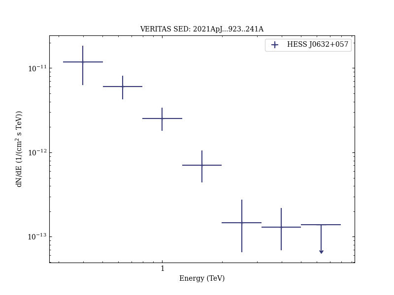
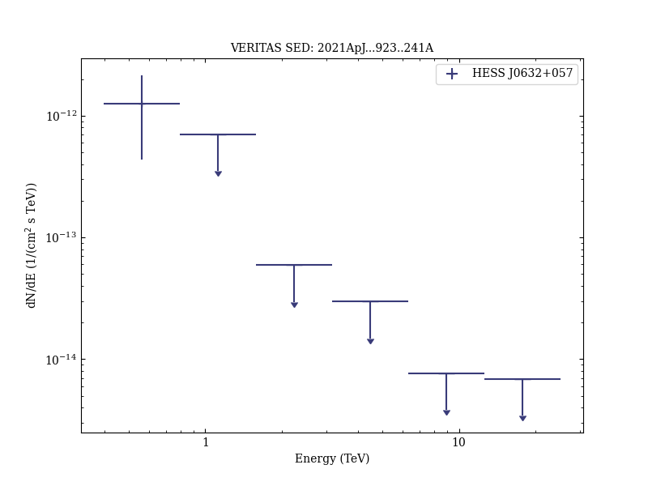

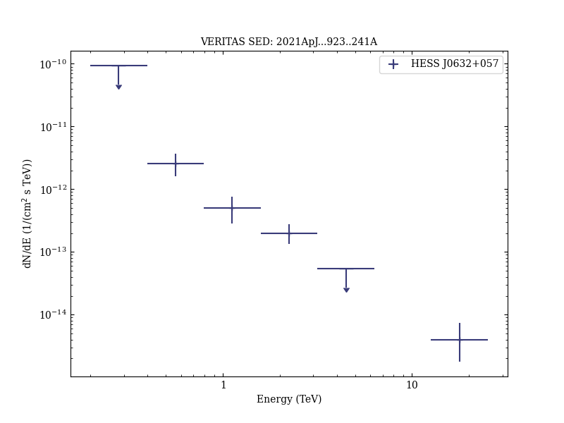
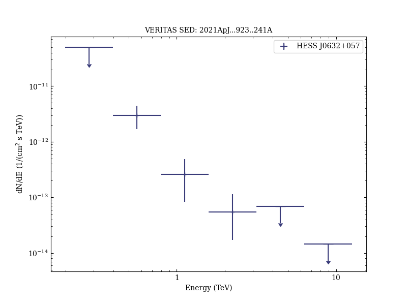

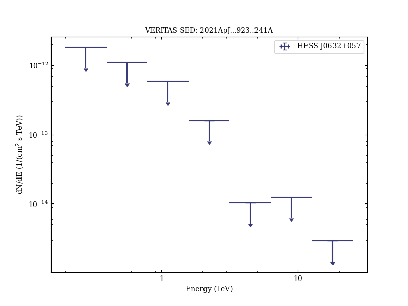
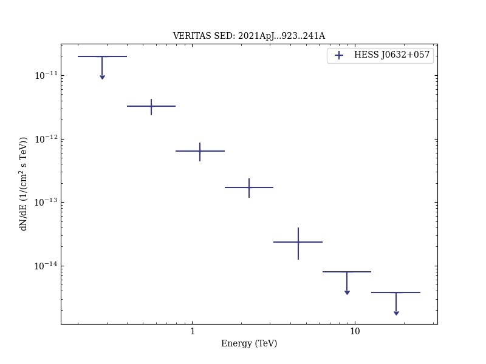
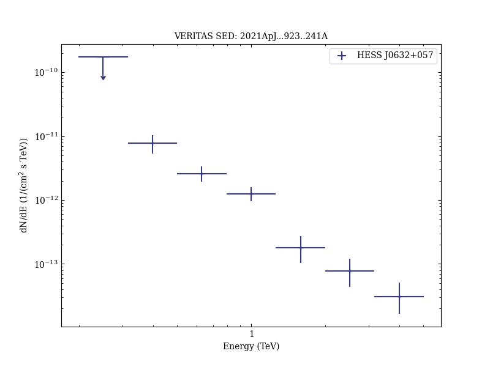

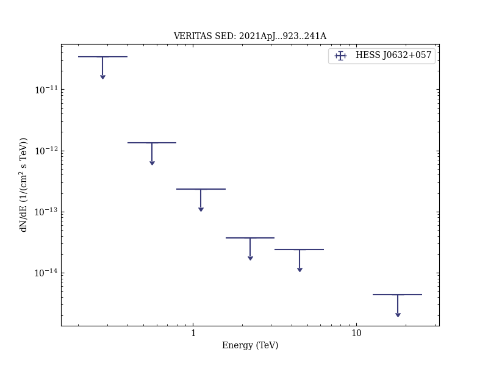
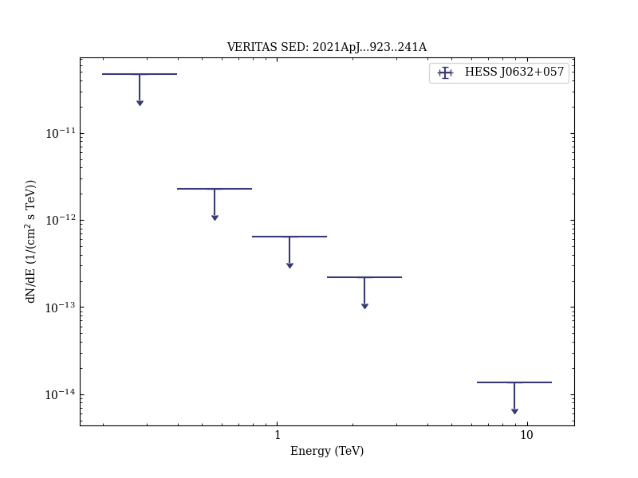

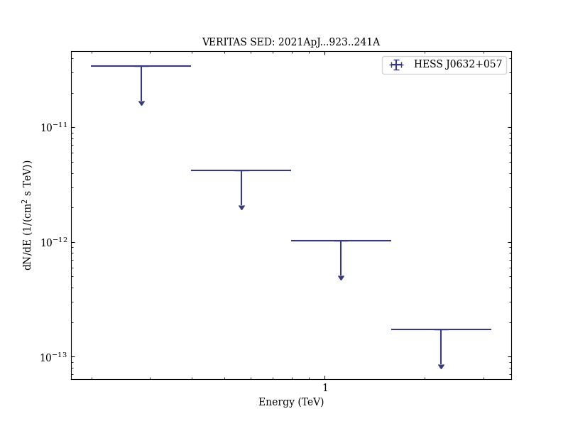
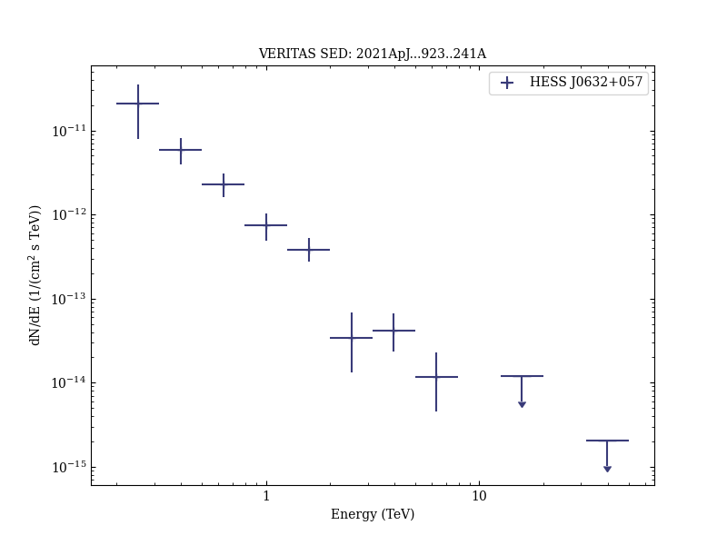

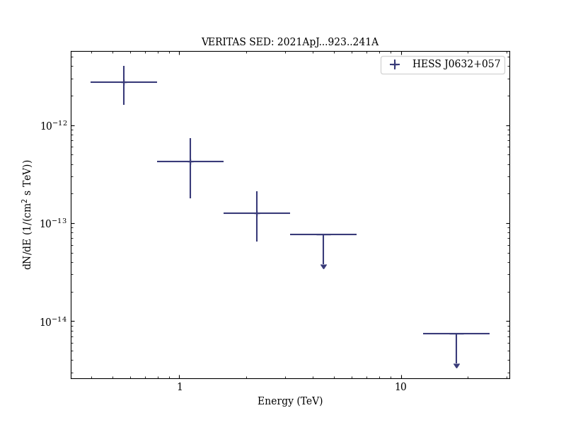
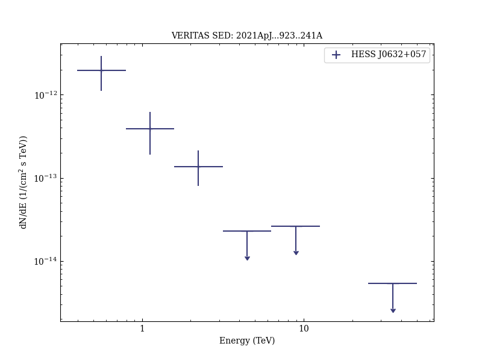

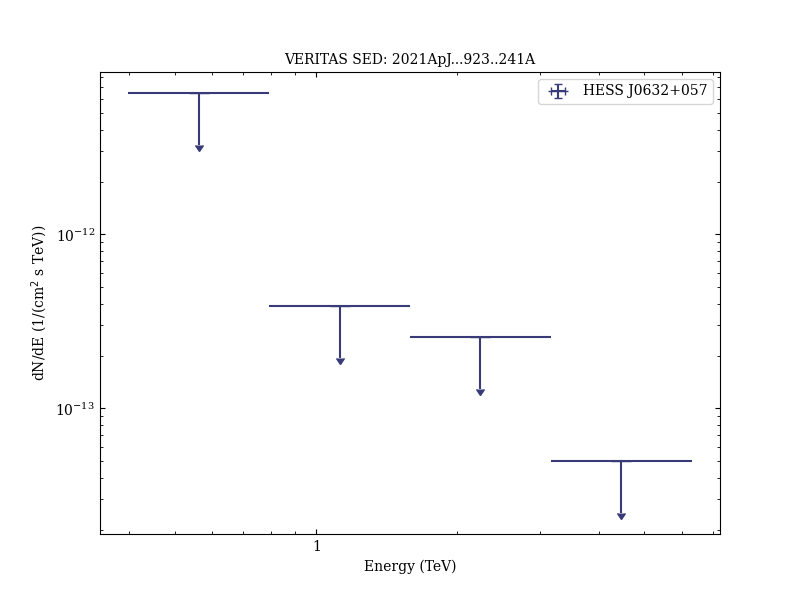

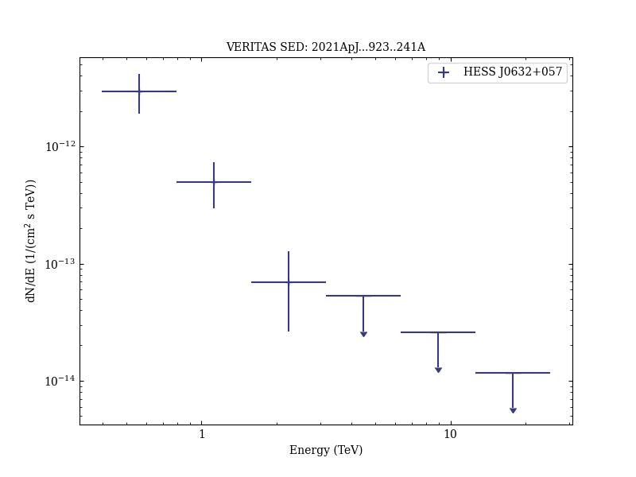

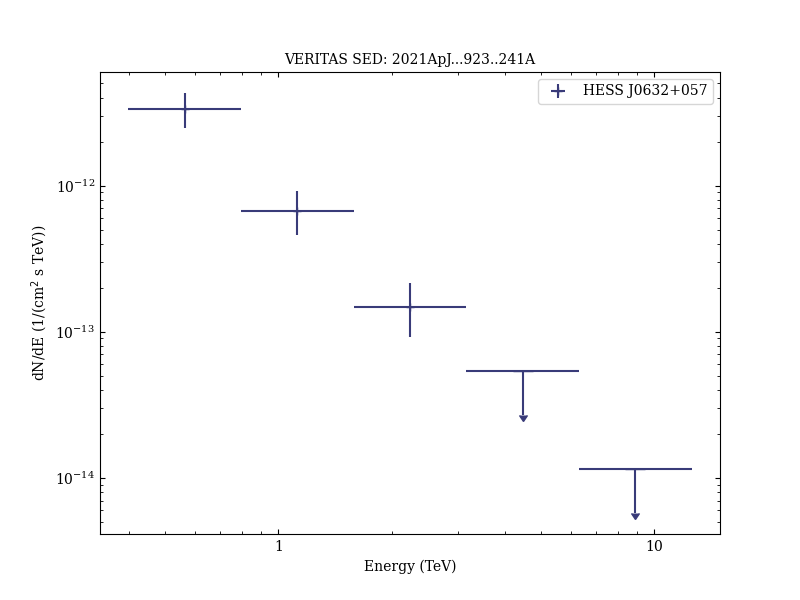
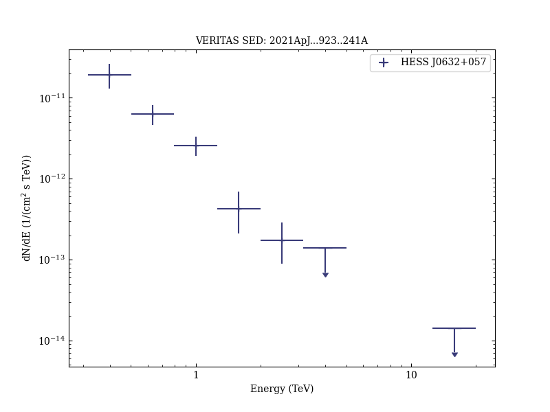

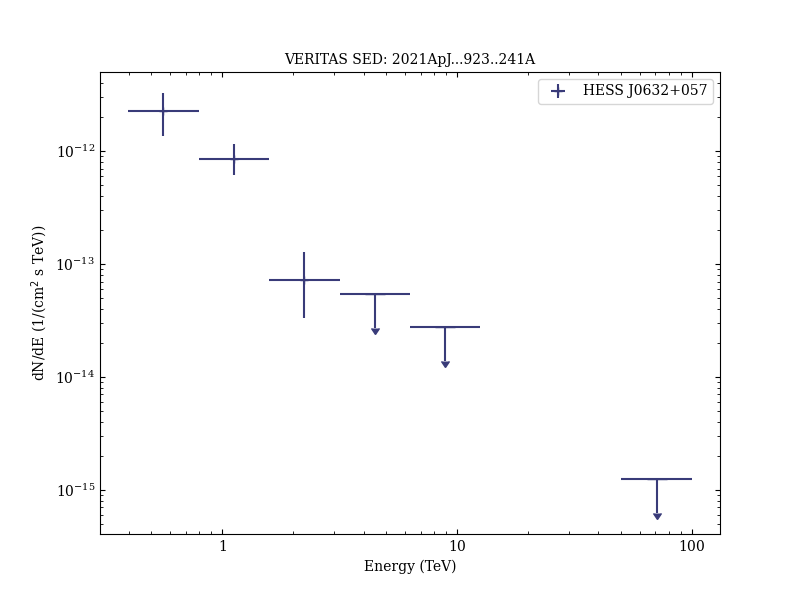
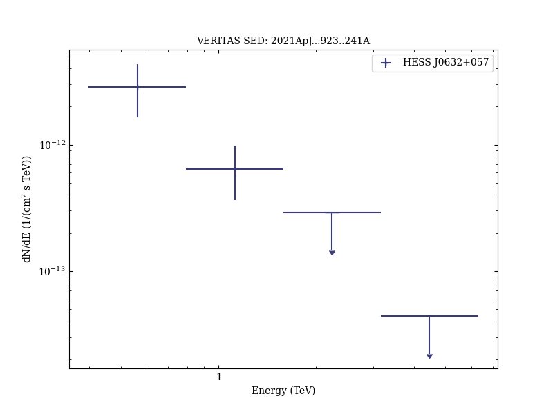

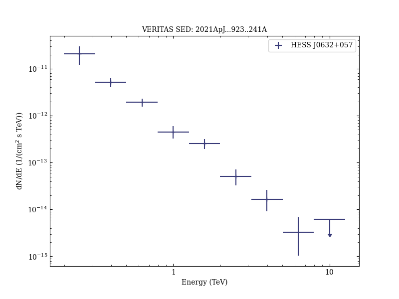

