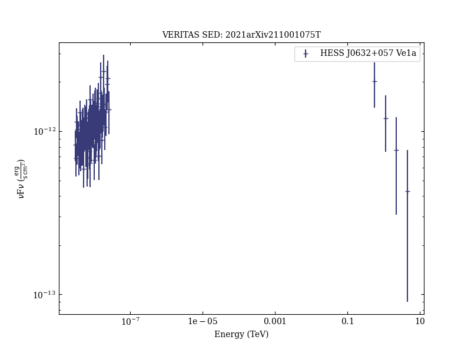
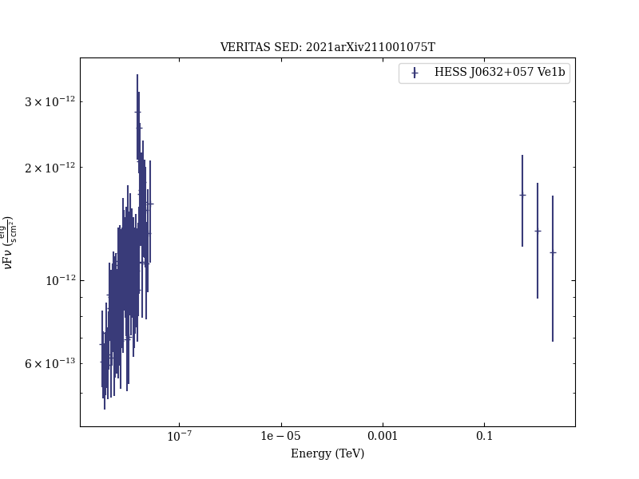
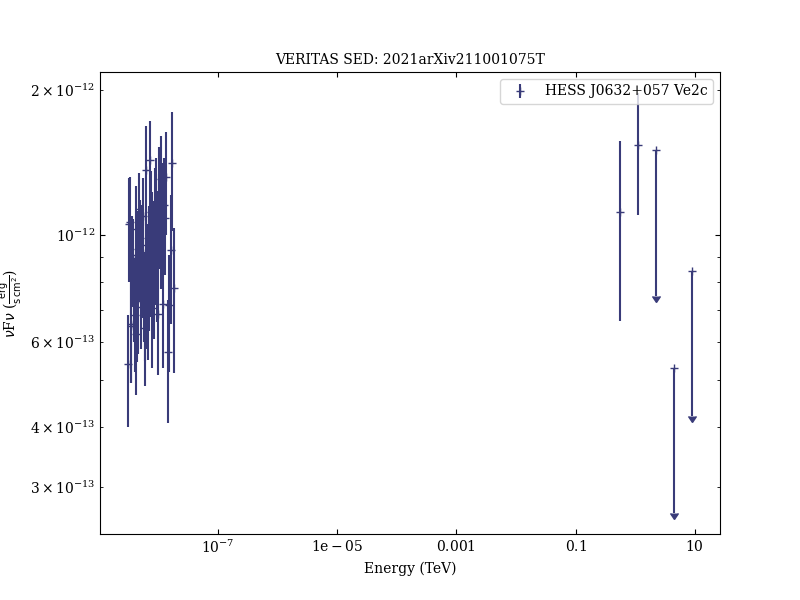
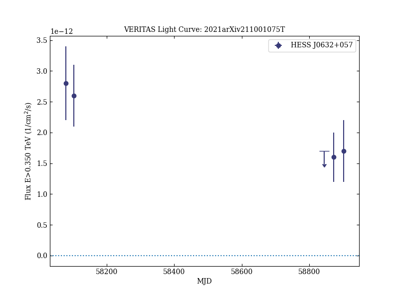
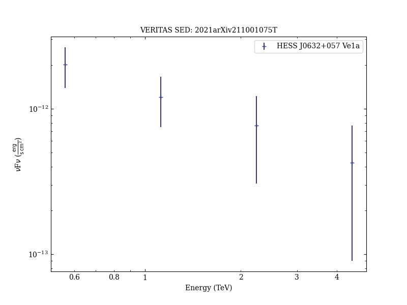
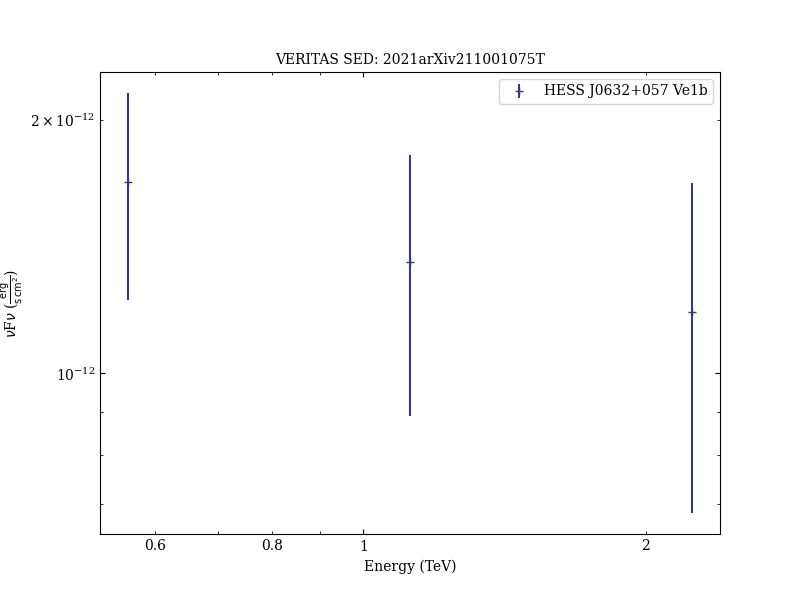
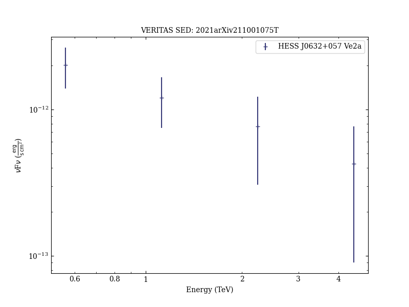
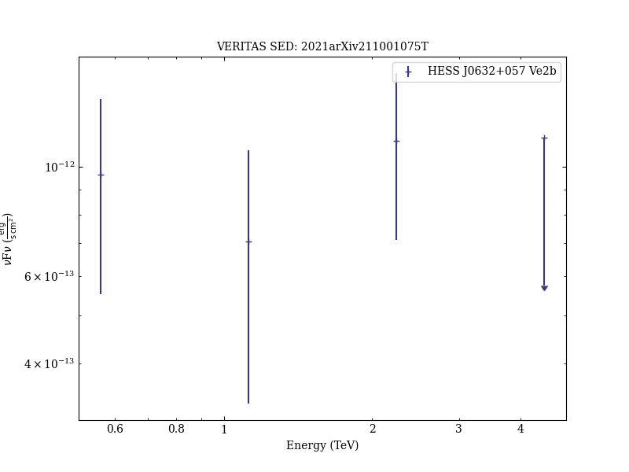
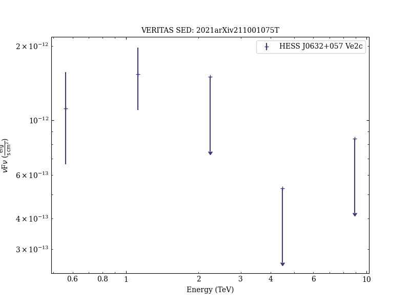

# Multi-Wavelength Observation Campaign of the TeV Gamma-Ray Binary HESS J0632+057 with NuSTAR, VERITAS, MDM, and Swift

Reference:
Tokayer, Y. M. et al. (The VERITAS Collaboration), arXiv:2110.01075 (2021)

- ADS: [2021arXiv211001075T](http://adsabs.harvard.edu/abs/2021arXiv211001075T)
## HESS J0632+057 (VER J0633+057)
### Data files

- spectral data: [VER-000030-sed-1.ecsv](VER-000030-sed-1.ecsv)  [VER-000030-sed-2.ecsv](VER-000030-sed-2.ecsv)  [VER-000030-sed-3.ecsv](VER-000030-sed-3.ecsv)  [VER-000030-sed-4.ecsv](VER-000030-sed-4.ecsv)  [VER-000030-sed-5.ecsv](VER-000030-sed-5.ecsv)  [MW-000030-sed-1.ecsv](MW-000030-sed-1.ecsv)  [MW-000030-sed-2.ecsv](MW-000030-sed-2.ecsv)  [MW-000030-sed-3.ecsv](MW-000030-sed-3.ecsv)  [MW-000030-sed-5.ecsv](MW-000030-sed-5.ecsv)  
- light-curve data: [VER-000030-lc-1.ecsv](VER-000030-lc-1.ecsv)  

### Figures

