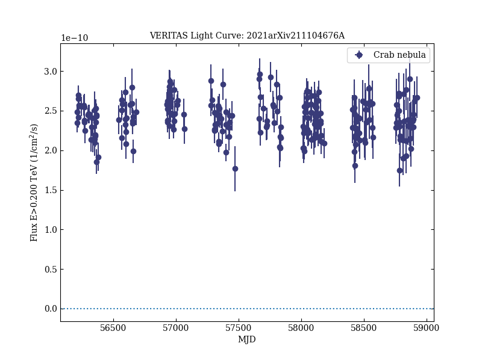
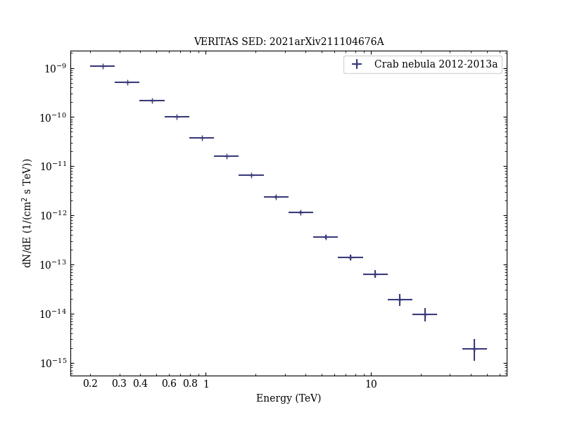
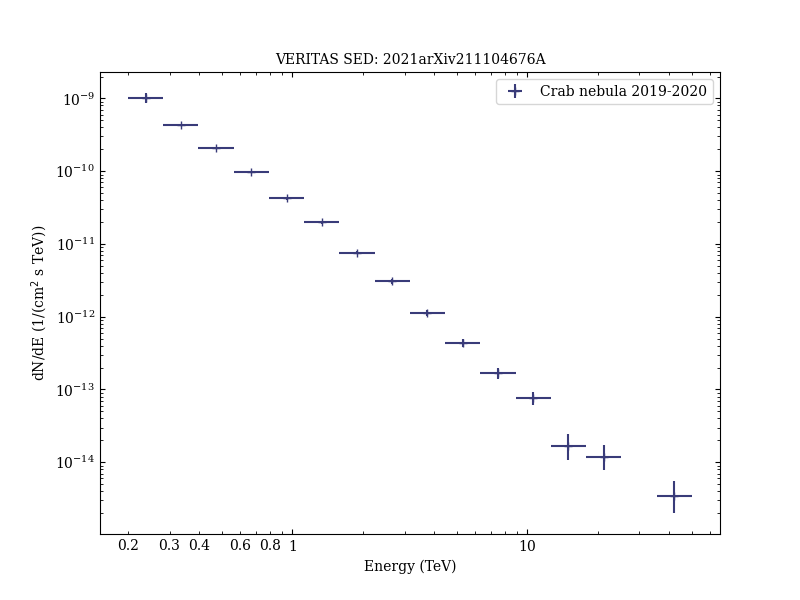
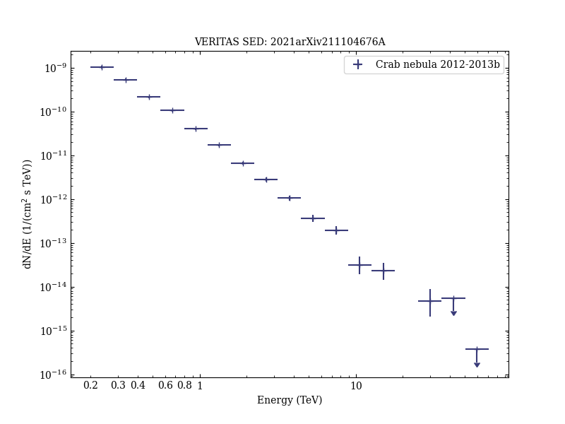
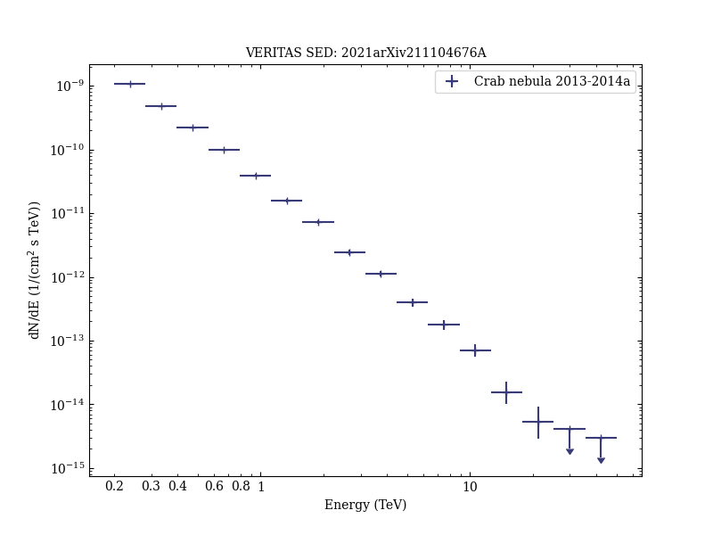
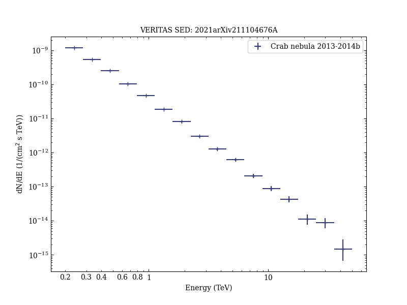
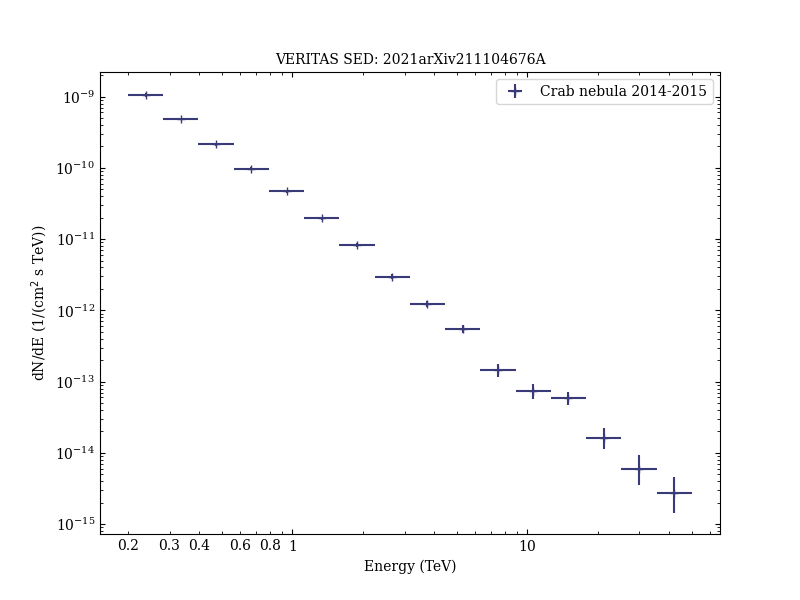
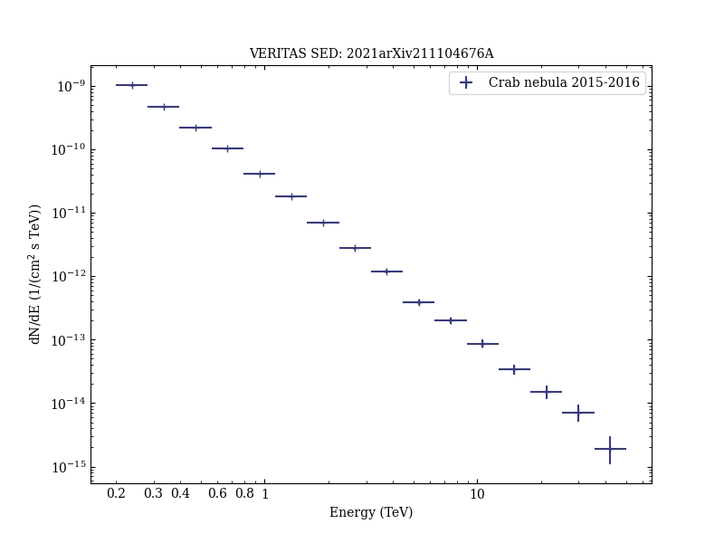
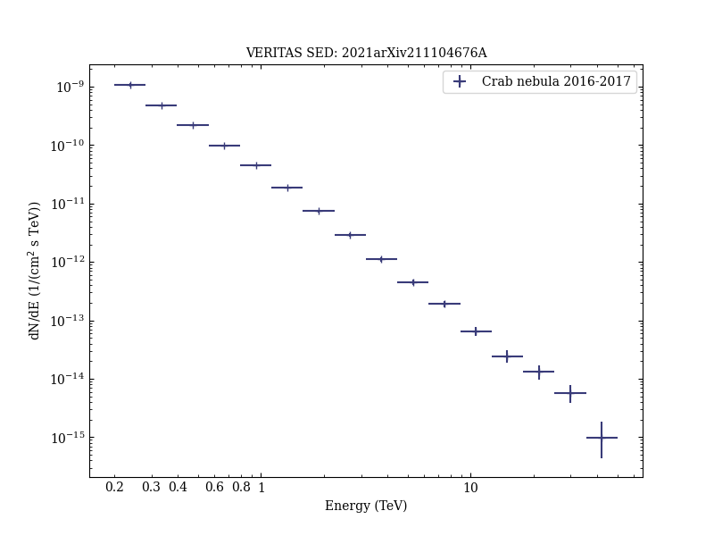
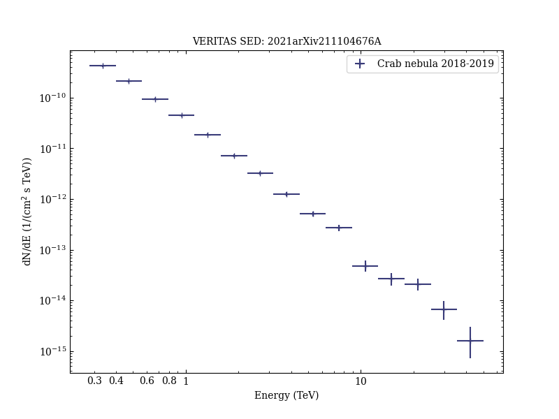

# The throughput calibration of the VERITAS telescopes

Reference:
Adams, C. B. et al. (The VERITAS Collaboration), arXiv:2111.04676 (2021)

- ADS: [2021arXiv211104676A](http://adsabs.harvard.edu/abs/2021arXiv211104676A)
### Data tables

- data tables: [VER-000025-table-figC1.ecsv](VER-000025-table-figC1.ecsv)  
## Crab nebula (VER J0534+220)
### Data files

- spectral data: [VER-000025-sed-1.ecsv](VER-000025-sed-1.ecsv)  [VER-000025-sed-2.ecsv](VER-000025-sed-2.ecsv)  [VER-000025-sed-3.ecsv](VER-000025-sed-3.ecsv)  [VER-000025-sed-4.ecsv](VER-000025-sed-4.ecsv)  [VER-000025-sed-5.ecsv](VER-000025-sed-5.ecsv)  [VER-000025-sed-6.ecsv](VER-000025-sed-6.ecsv)  [VER-000025-sed-7.ecsv](VER-000025-sed-7.ecsv)  [VER-000025-sed-8.ecsv](VER-000025-sed-8.ecsv)  [VER-000025-sed-9.ecsv](VER-000025-sed-9.ecsv)  [VER-000025-sed-10.ecsv](VER-000025-sed-10.ecsv)  
- light-curve data: [VER-000025-lc-1.ecsv](VER-000025-lc-1.ecsv)  

### Figures

