# Variability and Spectral Characteristics of Three Flaring Gamma-Ray Quasars Observed by VERITAS and Fermi-LAT

Reference:
Adams, C. B. et al. (The VERITAS Collaboration), The Astrophysical Journal, 924, 95 (2022)

- ADS: [2022ApJ...924...95A](http://adsabs.harvard.edu/abs/2022ApJ...924...95A)
- DOI: [10.3847/1538-4357/ac32bd](https://doi.org/10.3847/1538-4357/ac32bd)

## 3C 279
### Data files

- observation data: [VER-100199.yaml](VER-100199.yaml)  
- spectral data: [VER-100199-sed-1.ecsv](VER-100199-sed-1.ecsv)  [VER-100199-sed-2.ecsv](VER-100199-sed-2.ecsv)  [VER-100199-sed-3.ecsv](VER-100199-sed-3.ecsv)  [VER-100199-sed-4.ecsv](VER-100199-sed-4.ecsv)  [VER-100199-sed-5.ecsv](VER-100199-sed-5.ecsv)  
- light-curve data: [VER-100199-lc-1.ecsv](VER-100199-lc-1.ecsv)  
- observation data and fit results: [VER-100199.yaml](VER-100199.yaml)  

### Figures

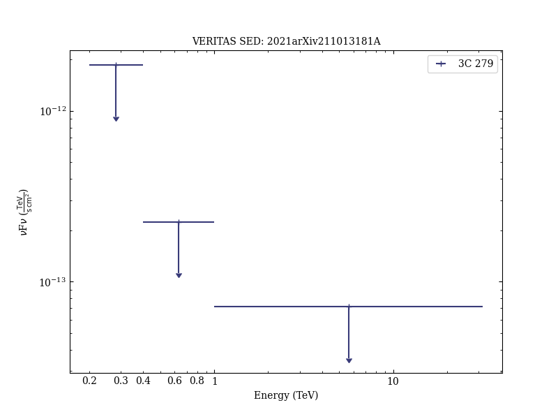
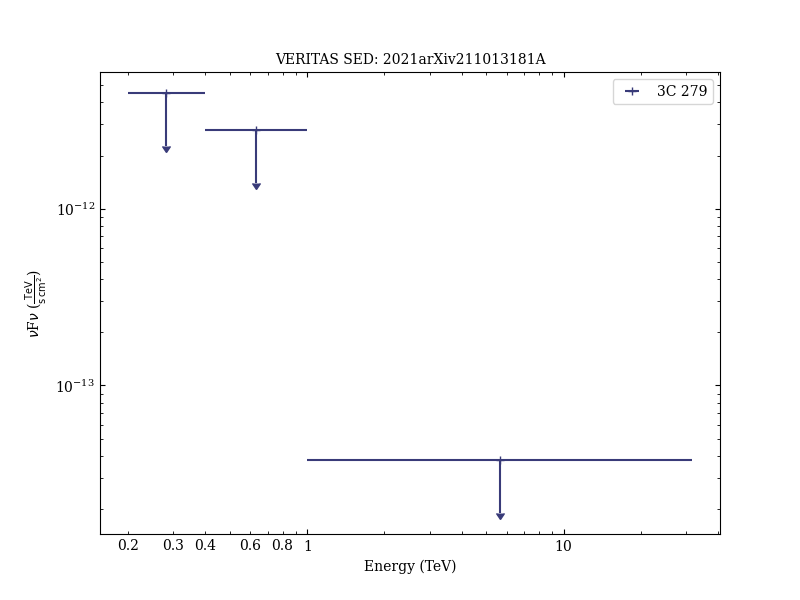
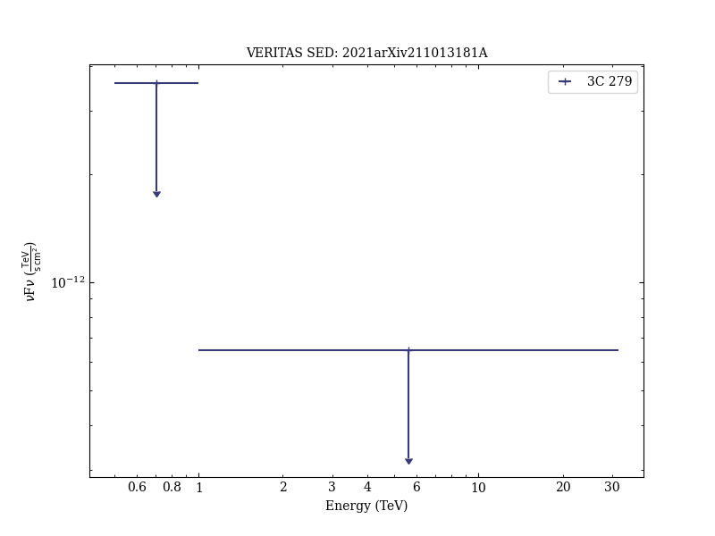
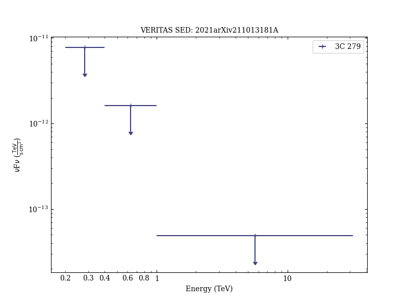
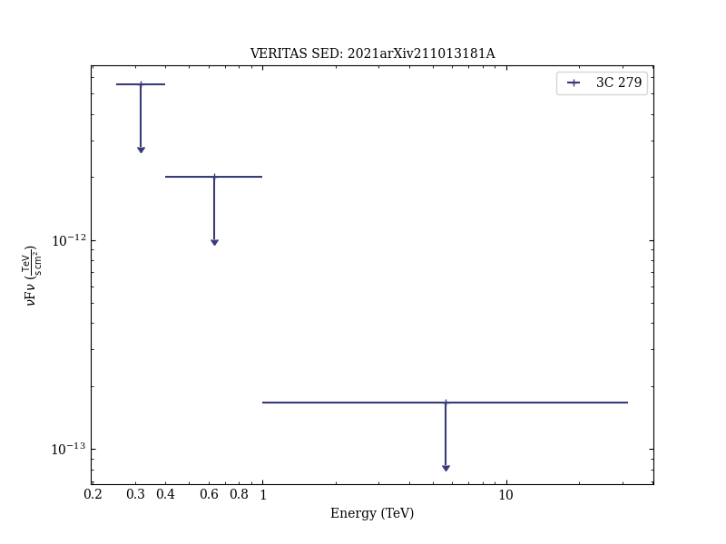
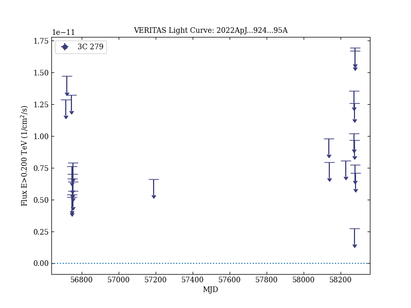
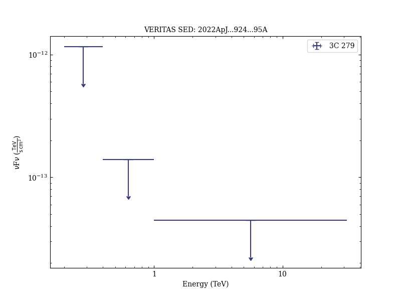
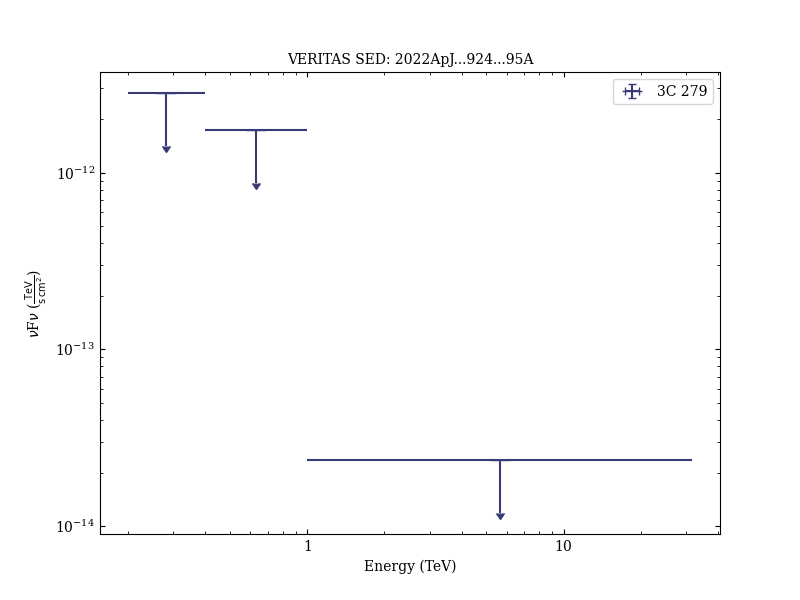

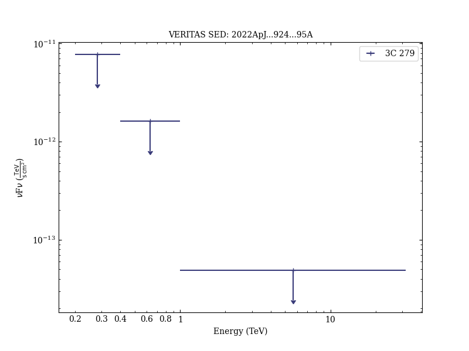
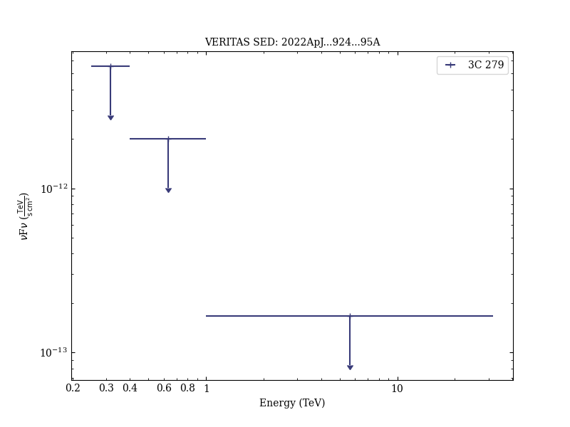

## PKS 1222+216
### Data files

- observation data: [VER-100200.yaml](VER-100200.yaml)  
- spectral data: [VER-100200-sed-1.ecsv](VER-100200-sed-1.ecsv)  
- light-curve data: [VER-100200-lc-1.ecsv](VER-100200-lc-1.ecsv)  
- observation data and fit results: [VER-100200.yaml](VER-100200.yaml)  

### Figures

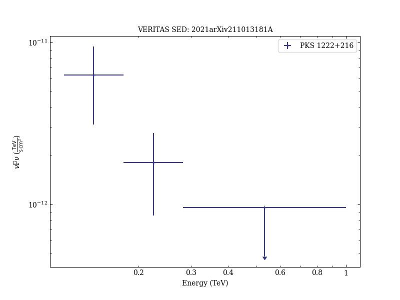
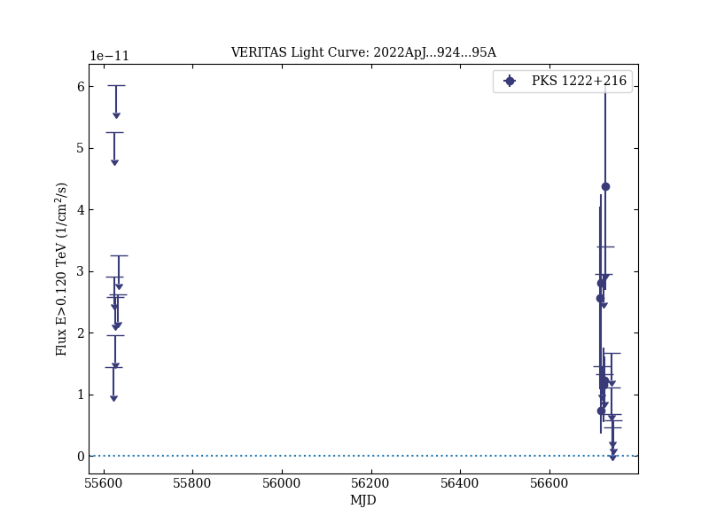
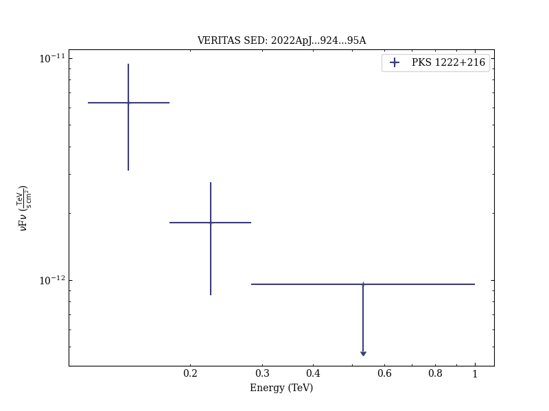

## Ton 599
### Data files

- observation data: [VER-100201.yaml](VER-100201.yaml)  
- spectral data: [VER-100201-sed-1.ecsv](VER-100201-sed-1.ecsv)  
- light-curve data: [VER-100201-lc-1.ecsv](VER-100201-lc-1.ecsv)  
- observation data and fit results: [VER-100201.yaml](VER-100201.yaml)  

### Figures

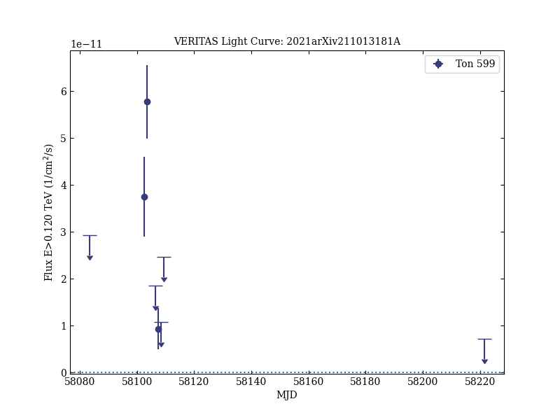
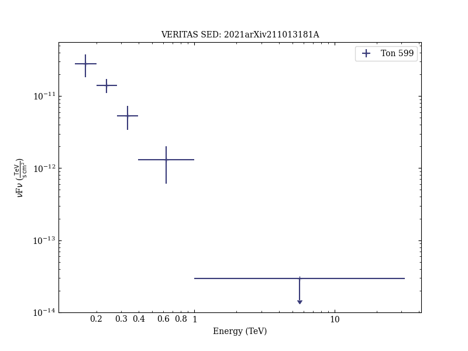
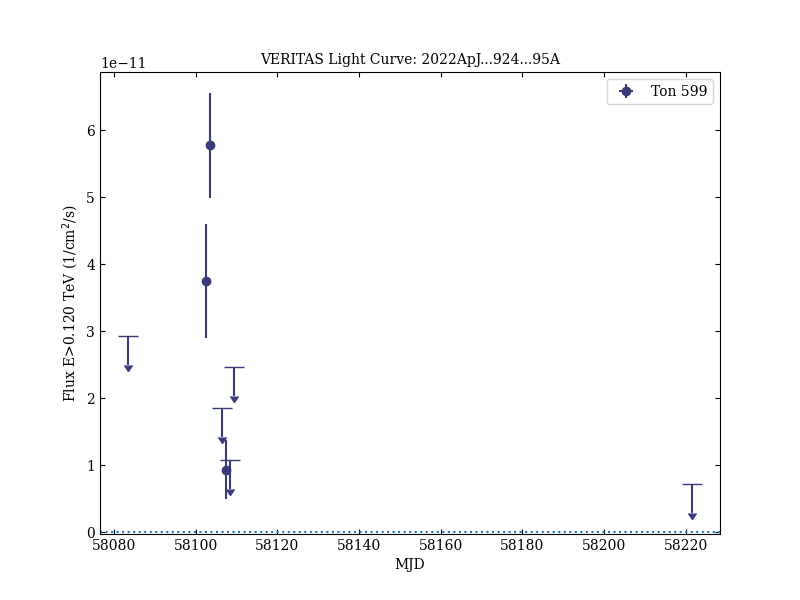
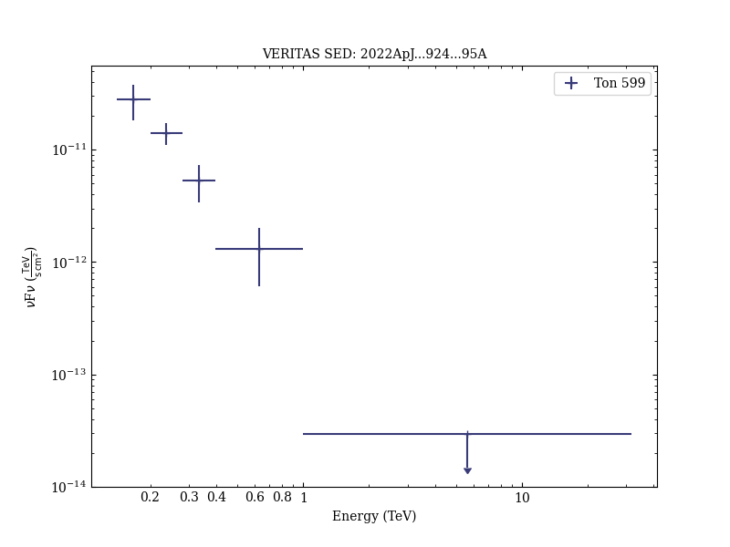

