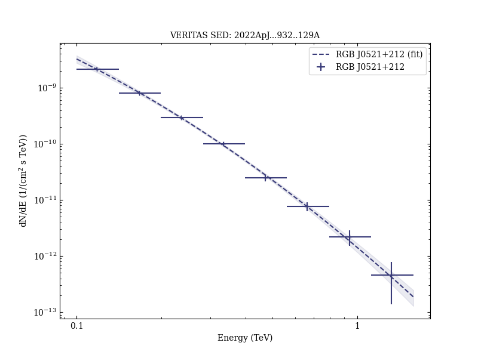
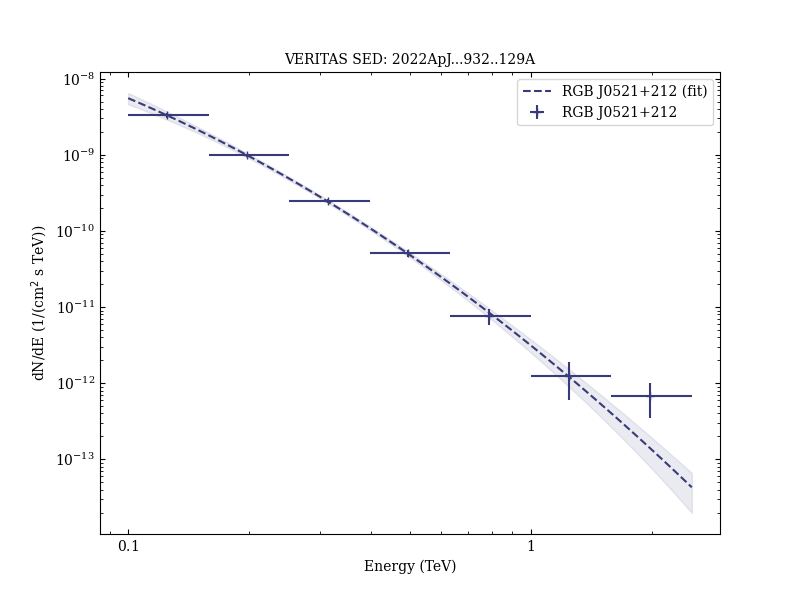

# Multiwavelength Observations of the Blazar VER J0521+211 during an Elevated TeV Gamma-Ray State

Reference:
Adams, C. B. et al. (The VERITAS and MAGIC Collaborations), The Astrophysical Journal, 932, 129 (2022)

- ADS: [2022ApJ...932..129A](http://adsabs.harvard.edu/abs/2022ApJ...932..129A)
- DOI: [10.3847/1538-4357/ac6dd9](https://doi.org/10.3847/1538-4357/ac6dd9)

## RGB J0521+212 (VER J0521+211)
### Data files

- observation data: [VER-000023.yaml](VER-000023.yaml)  [VER-000023-1.yaml](VER-000023-1.yaml)  [VER-000023-2.yaml](VER-000023-2.yaml)  [VER-000023-3.yaml](VER-000023-3.yaml)  
- spectral data: [VER-000023-1-sed.ecsv](VER-000023-1-sed.ecsv)  [VER-000023-2-sed.ecsv](VER-000023-2-sed.ecsv)  [VER-000023-3-sed.ecsv](VER-000023-3-sed.ecsv)  [MW-000023-sed.ecsv](MW-000023-sed.ecsv)  
- light-curve data: [VER-000023-1-lc.ecsv](VER-000023-1-lc.ecsv)  [VER-000023-2-lc.ecsv](VER-000023-2-lc.ecsv)  [VER-000023-3-lc.ecsv](VER-000023-3-lc.ecsv)  [MAGIC-000023-2-lc.ecsv](MAGIC-000023-2-lc.ecsv)  [LAT-000023-2-lc.ecsv](LAT-000023-2-lc.ecsv)  
- observation data and fit results: [VER-000023.yaml](VER-000023.yaml)  [VER-000023-1.yaml](VER-000023-1.yaml)  [VER-000023-2.yaml](VER-000023-2.yaml)  [VER-000023-3.yaml](VER-000023-3.yaml)  

### Figures

