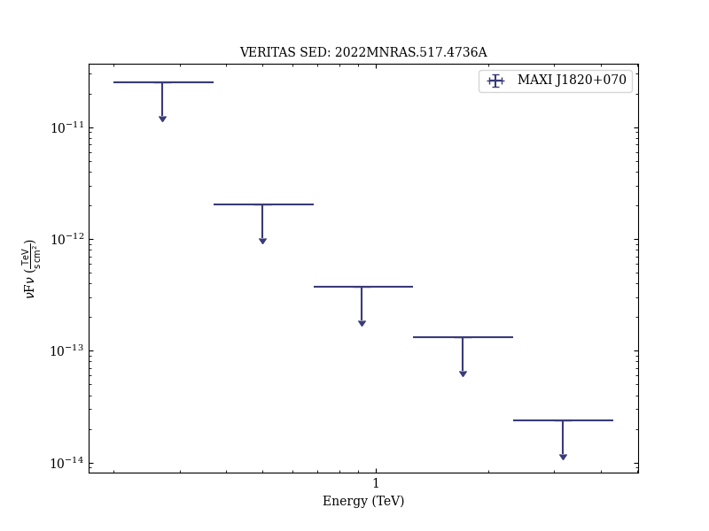

# Gamma-ray observations of MAXI J1820+070 during the 2018 outburst

Reference:
Abe, H. et al. (The VERITAS Collaboration), Monthly Notices of the Royal Astronomical Society, 517, 4736 (2022)

- ADS: [2022MNRAS.517.4736A](http://adsabs.harvard.edu/abs/2022MNRAS.517.4736A)
- DOI: [10.1093/mnras/stac2686](https://doi.org/10.1093/mnras/stac2686)

## MAXI J1820+070
### Data files

- observation data: [VER-100203.yaml](VER-100203.yaml)  
- spectral data: [VER-100203-sed-1.ecsv](VER-100203-sed-1.ecsv)  
- observation data and fit results: [VER-100203.yaml](VER-100203.yaml)  

### Figures

