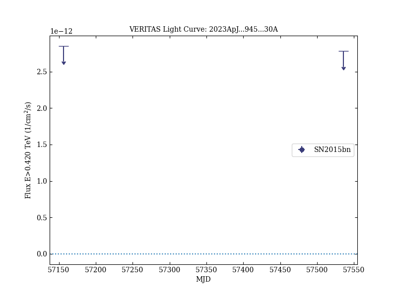
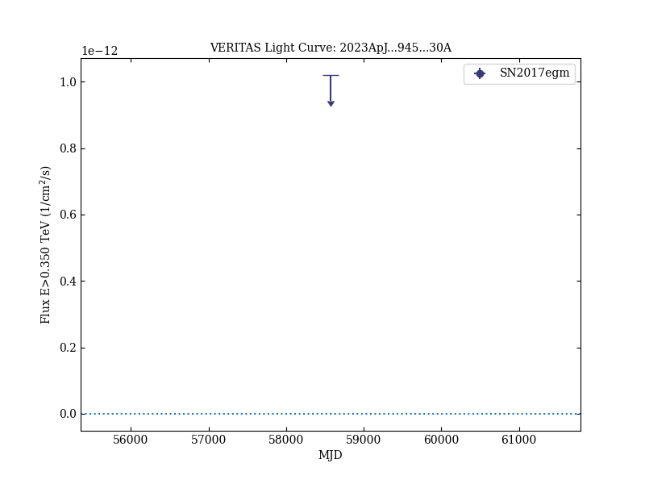

# VERITAS and Fermi-LAT Constraints on the Gamma-Ray Emission from Superluminous Supernovae SN2015bn and SN2017egm

Reference:
Acharyya, A. et al. (The VERITAS Collaboration), The Astrophysical Journal, 945, 30 (2023)

- ADS: [2023ApJ...945...30A](http://adsabs.harvard.edu/abs/2023ApJ...945...30A)
- DOI: [10.3847/1538-4357/acb7e6](https://doi.org/10.3847/1538-4357/acb7e6)

## SN2015bn
### Data files

- observation data: [VER-100204.yaml](VER-100204.yaml)
- light-curve data: [VER-100204-lc-1.ecsv](VER-100204-lc-1.ecsv)  [LAT-100204-lc-1.ecsv](LAT-100204-lc-1.ecsv)
- observation data and fit results: [VER-100204.yaml](VER-100204.yaml)

### Figures

## SN2017egm
### Data files

- observation data: [VER-100205.yaml](VER-100205.yaml)
- light-curve data: [VER-100205-lc-1.ecsv](VER-100205-lc-1.ecsv)  [LAT-100205-lc-1.ecsv](LAT-100205-lc-1.ecsv)
- observation data and fit results: [VER-100205.yaml](VER-100205.yaml)

### Figures

