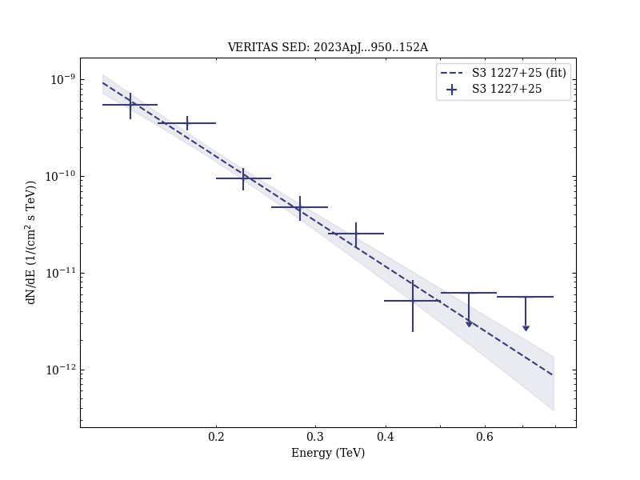

# VERITAS Discovery of Very High Energy Gamma-Ray Emission from S3 1227+25 and Multiwavelength Observations

Reference:
Acharyya, A. et al. (The VERITAS Collaboration), The Astrophysical Journal, 950, 152 (2023)

- ADS: [2023ApJ...950..152A](http://adsabs.harvard.edu/abs/2023ApJ...950..152A)
- DOI: [10.3847/1538-4357/acd2d0](https://doi.org/10.3847/1538-4357/acd2d0)

## S3 1227+25 (VER J1230+253)
### Data files

- observation data: [VER-000179.yaml](VER-000179.yaml)  
- spectral data: [VER-000179-1-sed.ecsv](VER-000179-1-sed.ecsv)  [LAT-000179-1-sed.ecsv](LAT-000179-1-sed.ecsv)  
- light-curve data: [VER-000179-1-lc.ecsv](VER-000179-1-lc.ecsv)  [LAT-000179-1-lc.ecsv](LAT-000179-1-lc.ecsv)  
- observation data and fit results: [VER-000179.yaml](VER-000179.yaml)  

### Figures

