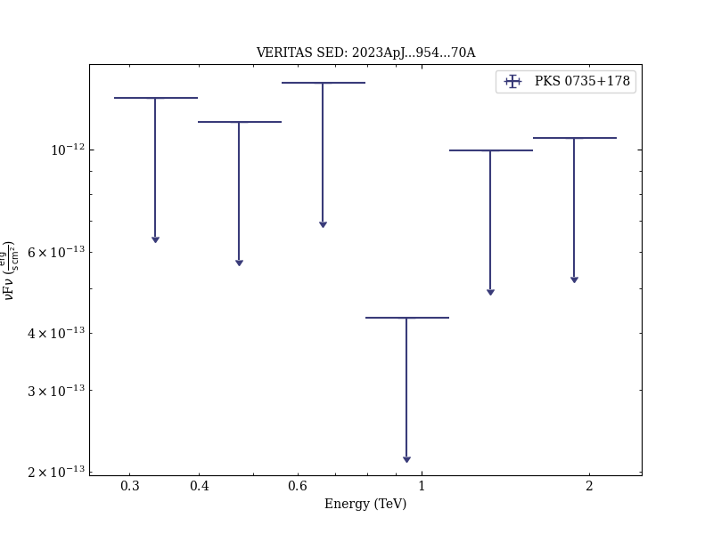

# Multiwavelength Observations of the Blazar PKS 0735+178 in Spatial and Temporal Coincidence with an Astrophysical Neutrino Candidate IceCube-211208A

Reference:
Acharyya, A. et al., The Astrophysical Journal, 954, 70 (2023)

- ADS: [2023ApJ...954...70A](http://adsabs.harvard.edu/abs/2023ApJ...954...70A)
- DOI: [10.3847/1538-4357/ace327](https://doi.org/10.3847/1538-4357/ace327)

## PKS 0735+178
### Data files

- observation data: [VER-100206.yaml](VER-100206.yaml)
- spectral data: [VER-100206-1-sed.ecsv](VER-100206-1-sed.ecsv)
- observation data and fit results: [VER-100206.yaml](VER-100206.yaml)

### Figures

