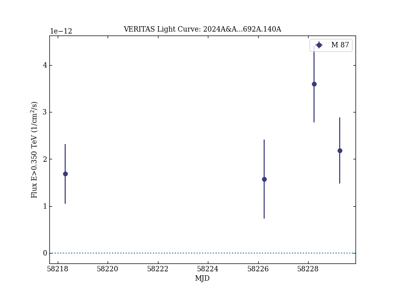
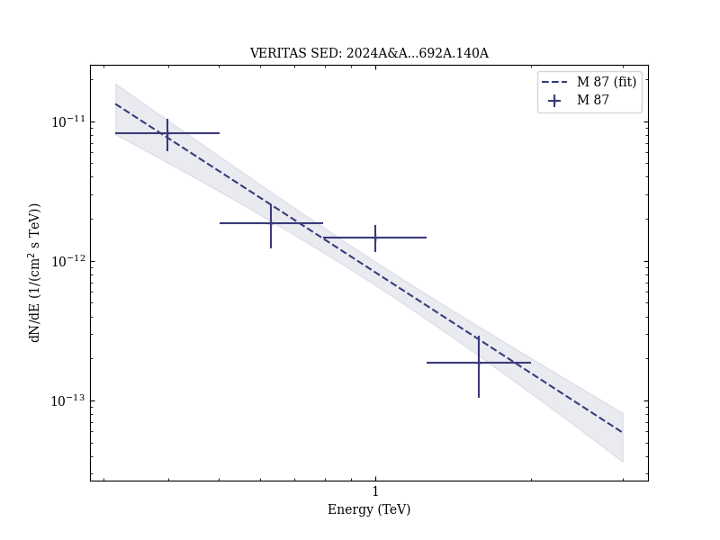

# Broadband multi-wavelength properties of M87 during the 2018 EHT campaign including a very high energy flaring episode

Reference:
Algaba, J. C. et al., Astronomy & Astrophysics, 692, A140 (2024)

- ADS: [2024A&A...692A.140A](http://adsabs.harvard.edu/abs/2024A&A...692A.140A)
- DOI: [10.1051/0004-6361/202450497](https://doi.org/10.1051/0004-6361/202450497)

## M 87 (VER J1230+123)
### Data files

- observation data: [VER-000058.yaml](VER-000058.yaml)
- spectral data: [VER-000058-sed-1.ecsv](VER-000058-sed-1.ecsv)
- light-curve data: [VER-000058-lc-1.ecsv](VER-000058-lc-1.ecsv)
- observation data and fit results: [VER-000058.yaml](VER-000058.yaml)

### Figures

