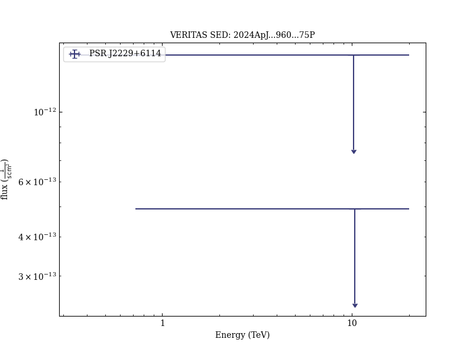

# A Multiwavelength Investigation of PSR J2229+6114 and its Pulsar Wind Nebula in the Radio, X-Ray, and Gamma-Ray Bands

Reference:
Pope, I. et al., The Astrophysical Journal, 960, 75 (2024)

- ADS: [2024ApJ...960...75P](http://adsabs.harvard.edu/abs/2024ApJ...960...75P)
- DOI: [10.3847/1538-4357/ad0120](https://doi.org/10.3847/1538-4357/ad0120)

## PSR J2229+6114
### Data files

- observation data: [VER-100207.yaml](VER-100207.yaml)
- spectral data: [VER-100207-sed-1.ecsv](VER-100207-sed-1.ecsv)  [VER-100207-sed-2.ecsv](VER-100207-sed-2.ecsv)  [VER-100207-sed-3.ecsv](VER-100207-sed-3.ecsv)
- observation data and fit results: [VER-100207.yaml](VER-100207.yaml)

### Figures

