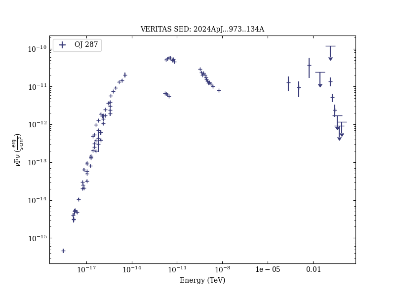
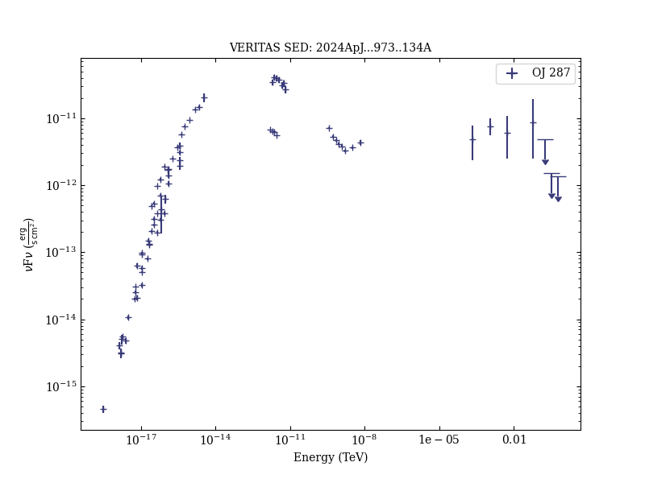
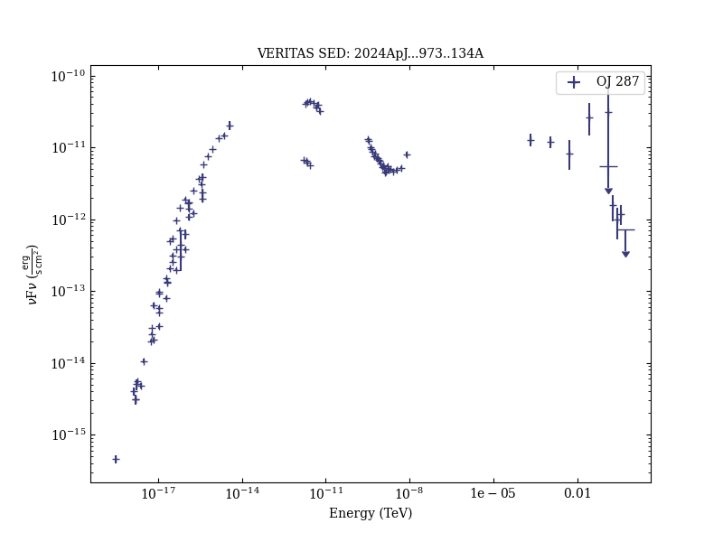
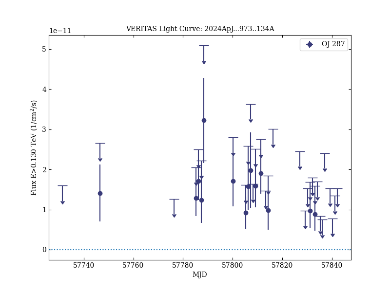
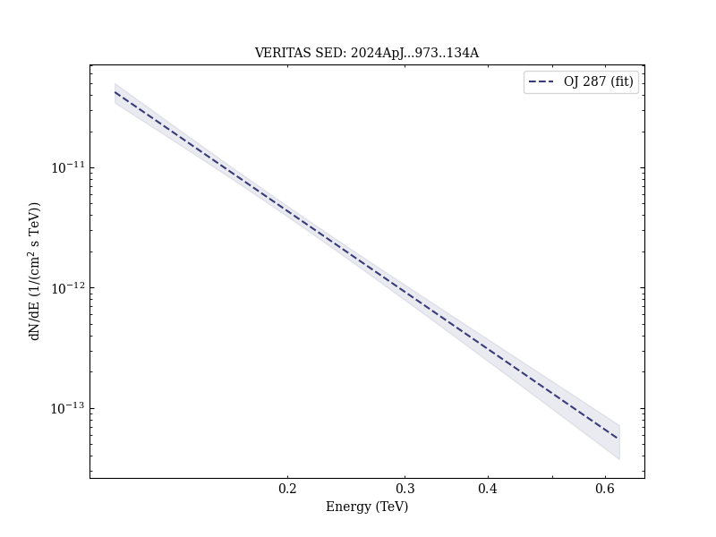
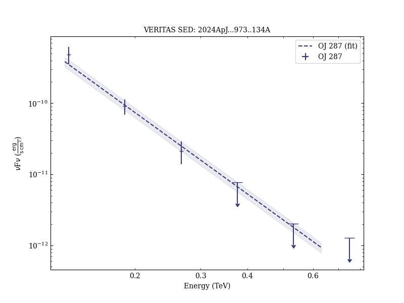
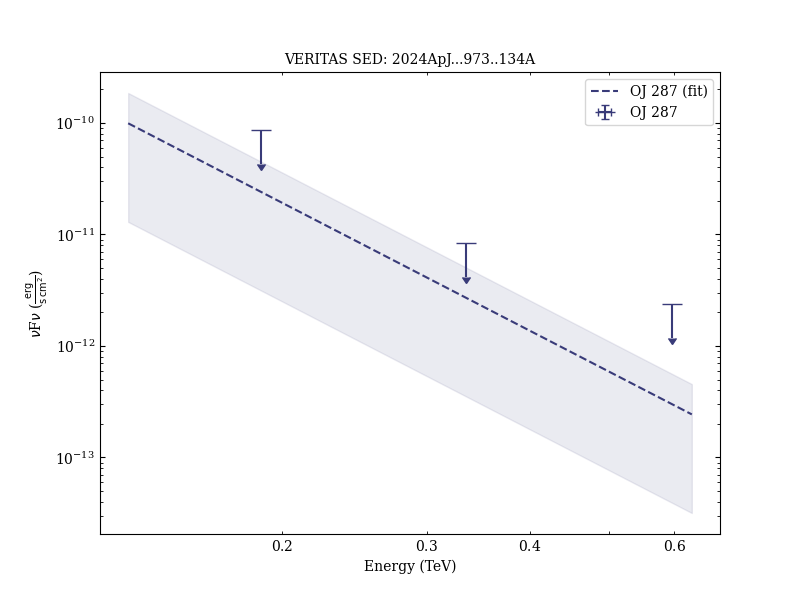
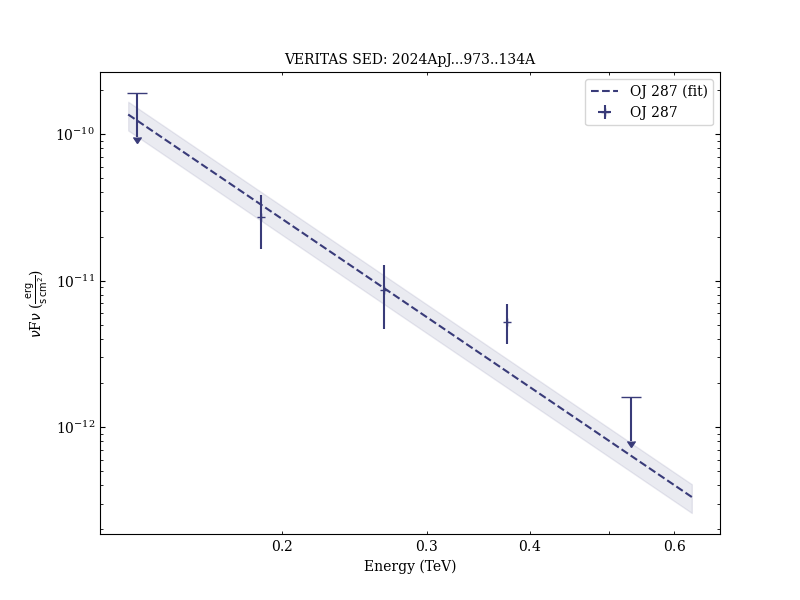

# A Multiwavelength Study to Decipher the 2017 Flare of the Blazar OJ 287

Reference:
Acharyya, A. et al. (The VERITAS, LAT, XRT, UVOT, and OVRO Collaborations), The Astrophysical Journal, 973, 134 (2024)

- ADS: [2024ApJ...973..134A](http://adsabs.harvard.edu/abs/2024ApJ...973..134A)
- DOI: [10.3847/1538-4357/ad64d0](https://doi.org/10.3847/1538-4357/ad64d0)

## OJ 287 (VER J0854+201)
### Data files

- observation data: [VER-000180.yaml](VER-000180.yaml)  [VER-000180-2.yaml](VER-000180-2.yaml)  [VER-000180-3.yaml](VER-000180-3.yaml)  [VER-000180-4.yaml](VER-000180-4.yaml)
- spectral data: [VER-000180-sed-2.ecsv](VER-000180-sed-2.ecsv)  [VER-000180-sed-3.ecsv](VER-000180-sed-3.ecsv)  [VER-000180-sed-4.ecsv](VER-000180-sed-4.ecsv)  [MW-000180-sed-2.ecsv](MW-000180-sed-2.ecsv)  [MW-000180-sed-3.ecsv](MW-000180-sed-3.ecsv)  [MW-000180-sed-4.ecsv](MW-000180-sed-4.ecsv)
- light-curve data: [VER-000180-lc-1.ecsv](VER-000180-lc-1.ecsv)  [LAT-000180-lc-1.ecsv](LAT-000180-lc-1.ecsv)  [XRT-000180-lc-1.ecsv](XRT-000180-lc-1.ecsv)
- observation data and fit results: [VER-000180.yaml](VER-000180.yaml)  [VER-000180-2.yaml](VER-000180-2.yaml)  [VER-000180-3.yaml](VER-000180-3.yaml)  [VER-000180-4.yaml](VER-000180-4.yaml)

### Figures

