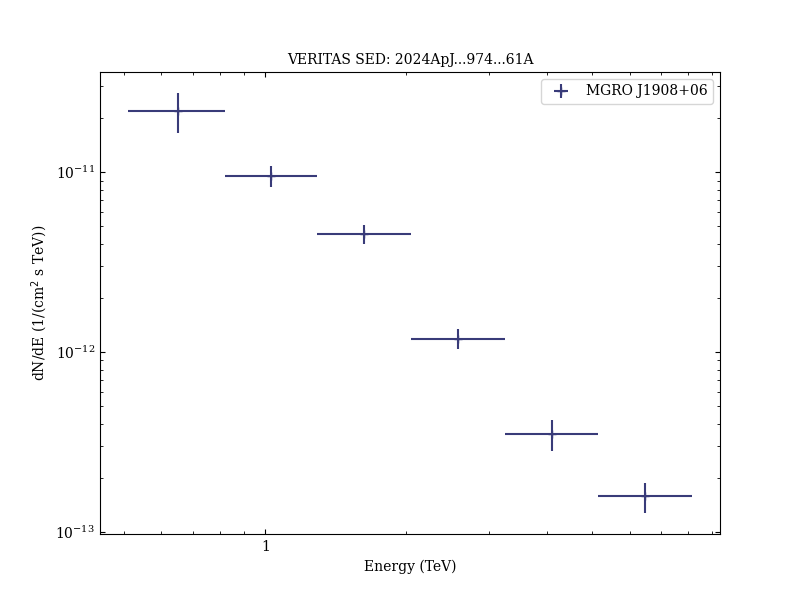

# Multiwavelength Investigation of γ-Ray Source MGRO J1908+06 Emission Using Fermi-LAT, VERITAS and HAWC

Reference:
Acharyya, A. et al., The Astrophysical Journal, 974, 61 (2024)

- ADS: [2024ApJ...974...61A](http://adsabs.harvard.edu/abs/2024ApJ...974...61A)
- DOI: [10.3847/1538-4357/ad698d](https://doi.org/10.3847/1538-4357/ad698d)

## MGRO J1908+06 (VER J1907+062)
### Data files

- observation data: [VER-000132.yaml](VER-000132.yaml)
- spectral data: [VER-000132-sed-1.ecsv](VER-000132-sed-1.ecsv)
- observation data and fit results: [VER-000132.yaml](VER-000132.yaml)
- FITS data: [VER-000132-excess-skymap-1995-7943GeV.fits](VER-000132-excess-skymap-1995-7943GeV.fits)  [VER-000132-excess-skymap-501-1995GeV.fits](VER-000132-excess-skymap-501-1995GeV.fits)

### Figures

