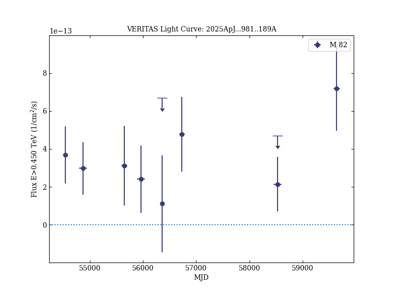
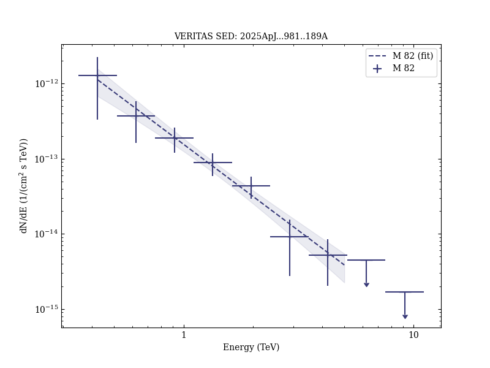

# An In-depth Study of Gamma Rays from the Starburst Galaxy M82 with VERITAS

Reference:
Acharyya, A. et al. (The VERITAS Collaboration), The Astrophysical Journal, 981, 189 (2025)

- ADS: [2025ApJ...981..189A](http://adsabs.harvard.edu/abs/2025ApJ...981..189A)
- DOI: [10.3847/1538-4357/adab71](https://doi.org/10.3847/1538-4357/adab71)

## M 82 (VER J0955+696)
### Data files

- observation data: [VER-000040-1.yaml](VER-000040-1.yaml)  [VER-000040-2.yaml](VER-000040-2.yaml)  [VER-000040-3.yaml](VER-000040-3.yaml)
- spectral data: [VER-000040-sed-1.ecsv](VER-000040-sed-1.ecsv)
- light-curve data: [VER-000040-lc-1.ecsv](VER-000040-lc-1.ecsv)
- observation data and fit results: [VER-000040-1.yaml](VER-000040-1.yaml)  [VER-000040-2.yaml](VER-000040-2.yaml)  [VER-000040-3.yaml](VER-000040-3.yaml)
- FITS data: [VER-000040-excess-skymap.fits](VER-000040-excess-skymap.fits)

### Figures

