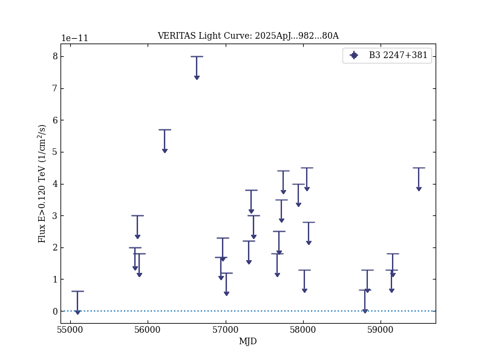

# VERITAS and Multiwavelength Observations of the Blazar B3 2247+381 in Response to an IceCube Neutrino Alert

Reference:
Acharyya, A. et al., The Astrophysical Journal, 982, 80 (2025)

- ADS: [2025ApJ...982...80A](http://adsabs.harvard.edu/abs/2025ApJ...982...80A)
- DOI: [10.3847/1538-4357/adb30c](https://doi.org/10.3847/1538-4357/adb30c)

## B3 2247+381
### Data files

- observation data: [VER-100222-1.yaml](VER-100222-1.yaml)  [VER-100222-2.yaml](VER-100222-2.yaml)
- light-curve data: [VER-100222-lc-1.ecsv](VER-100222-lc-1.ecsv)
- observation data and fit results: [VER-100222-1.yaml](VER-100222-1.yaml)  [VER-100222-2.yaml](VER-100222-2.yaml)

### Figures

