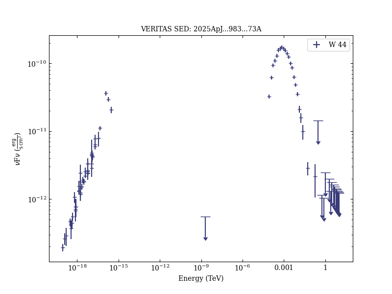

# Constraints on the X-Ray and Very-high-energy Gamma-Ray Flux from Supernova Remnant W44

Reference:
Archer, A. et al. (The VERITAS Collaboration), The Astrophysical Journal, 983, 73 (2025)

- ADS: [2025ApJ...983...73A](http://ui.adsabs.harvard.edu/abs/2025ApJ...983...73A)
- DOI: [10.3847/1538-4357/adc07d](https://doi.org/10.3847/1538-4357/adc07d)

## W 44
### Data files

- spectral data: [MW-100223-1.sed.ecsv](MW-100223-1.sed.ecsv)

### Figures

