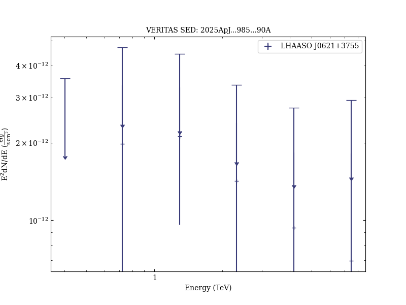

# Multiwavelength Observation of a Candidate Pulsar Halo LHAASO J0621+3755 and the First X-Ray Detection of PSR J0622+3749

Reference:
Adams, C. B. et al., The Astrophysical Journal, 985, 90 (2025)

- ADS: [2025ApJ...985...90A](http://ui.adsabs.harvard.edu/abs/2025ApJ...985...90A)
- DOI: [10.3847/1538-4357/adc92b](https://doi.org/10.3847/1538-4357/adc92b)

## LHAASO J0621+3755
### Data files

- observation data: [VER-100224-1.yaml](VER-100224-1.yaml)
- spectral data: [VER-100224-sed-1.ecsv](VER-100224-sed-1.ecsv)
- observation data and fit results: [VER-100224-1.yaml](VER-100224-1.yaml)
- FITS data: [VER-100224-sqrt-ts-skymap.fits](VER-100224-sqrt-ts-skymap.fits)

### Figures

