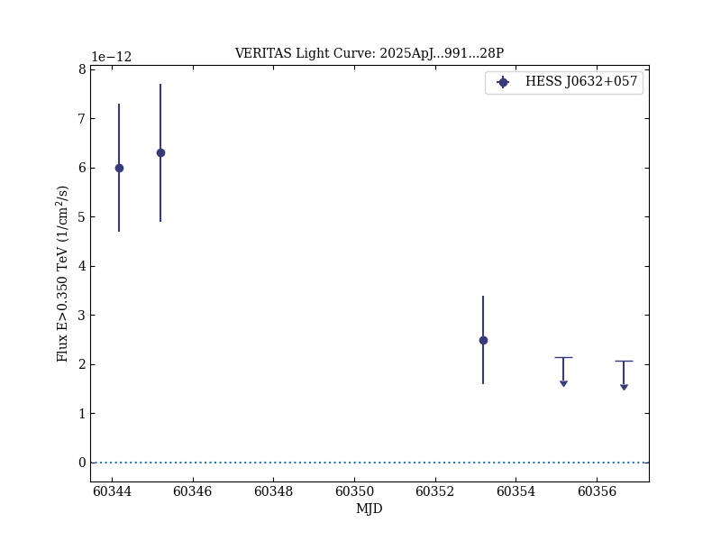
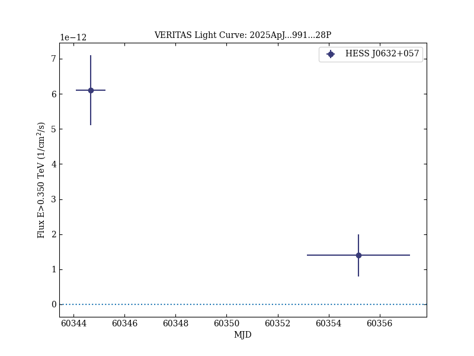

# Multiwavelength Study of HESS J0632+057: New Insights into Pulsar–Disk Interaction

Reference:
Park, Jaegeun et al. (The VERITAS Collaboration), The Astrophysical Journal, 991, 28 (2025)

- ADS: [2025ApJ...991...28P](http://adsabs.harvard.edu/abs/2025ApJ...991...28P)
- DOI: [10.3847/1538-4357/adf6b6](https://doi.org/10.3847/1538-4357/adf6b6)

## HESS J0632+057 (VER J0633+057)
### Data files

- observation data: [VER-000030-1.yaml](VER-000030-1.yaml)
- light-curve data: [VER-000030-lc-1.ecsv](VER-000030-lc-1.ecsv)  [VER-000030-lc-2.ecsv](VER-000030-lc-2.ecsv)
- observation data and fit results: [VER-000030-1.yaml](VER-000030-1.yaml)

### Figures

