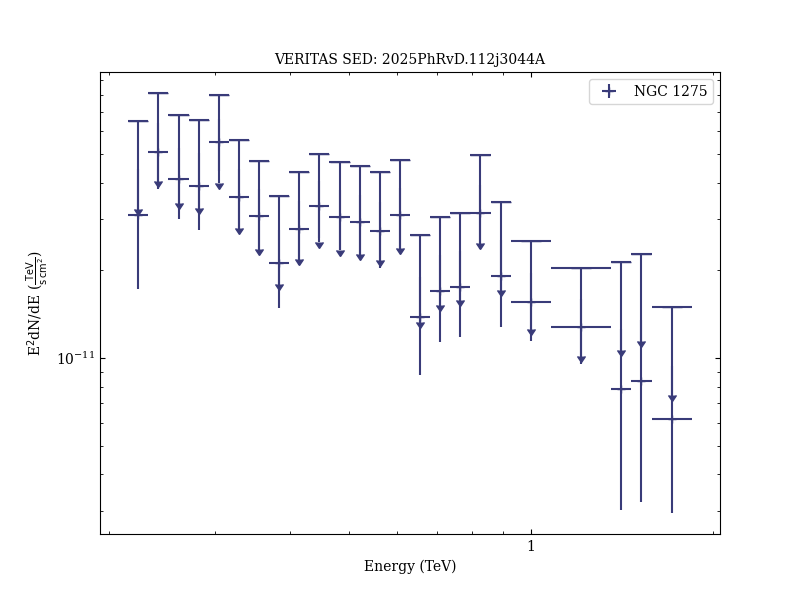

# Constraints on axionlike particles from VERITAS observations of a flaring radio galaxy in the Perseus cluster

Reference:
Adams, C. B. et al. (The VERITAS Collaboration), Physical Review D, 112, 103044 (2025)

- ADS: [2025PhRvD.112j3044A](http://adsabs.harvard.edu/abs/2025PhRvD.112j3044A)
- DOI: [10.1103/jydc-npy6](https://doi.org/10.1103/jydc-npy6)

## NGC 1275 (VER J0319+415)
### Data files

- observation data: [VER-000018-1.yaml](VER-000018-1.yaml)
- spectral data: [VER-000018-sed-1.ecsv](VER-000018-sed-1.ecsv)
- observation data and fit results: [VER-000018-1.yaml](VER-000018-1.yaml)

### Figures

