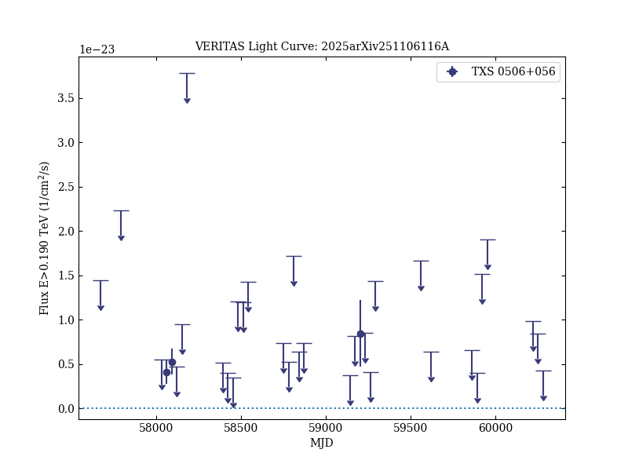
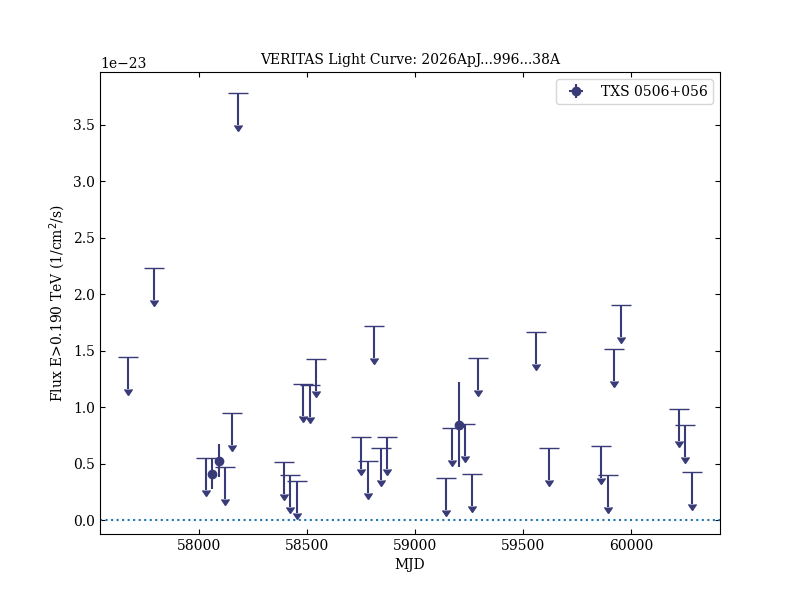
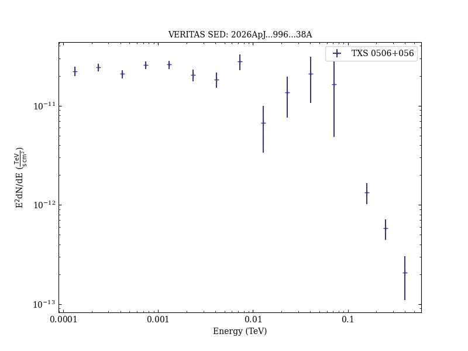

# Probing a Cosmogenic Origin of Astrophysical Neutrinos and Cosmic Rays Using Gamma-Ray Observations of TXS 0506+056

Reference:
Acharyya, A. et al., The Astrophysical Journal, 996, 38 (2026)

- ADS: [2026ApJ...996...38A](http://adsabs.harvard.edu/abs/2026ApJ...996...38A)
- DOI: [10.3847/1538-4357/ae1d72](https://doi.org/10.3847/1538-4357/ae1d72)

## TXS 0506+056 (VER J0509+057)
### Data files

- observation data: [VER-000168-1.yaml](VER-000168-1.yaml)
- spectral data: [VER-000168-sed-1.ecsv](VER-000168-sed-1.ecsv)
- light-curve data: [VER-000168-lc-1.ecsv](VER-000168-lc-1.ecsv)  [LAT-000168-lc-1.ecsv](LAT-000168-lc-1.ecsv)  [XRT-000168-lc-1.ecsv](XRT-000168-lc-1.ecsv)
- observation data and fit results: [VER-000168-1.yaml](VER-000168-1.yaml)

### Figures

