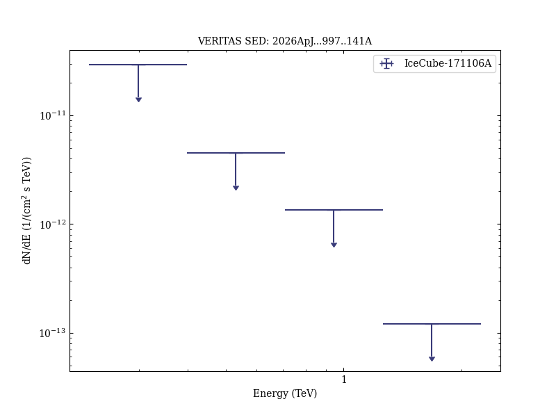
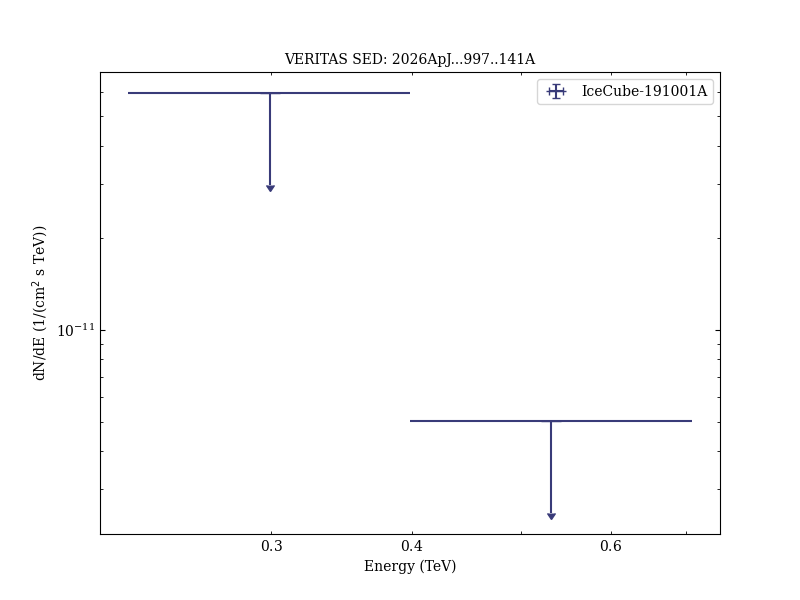
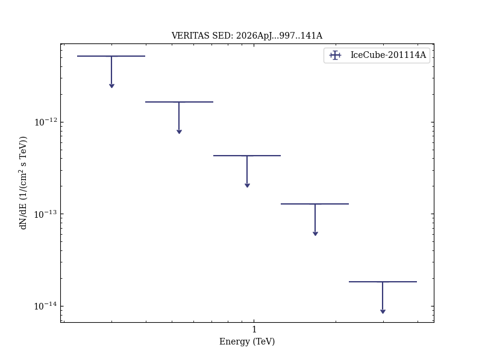
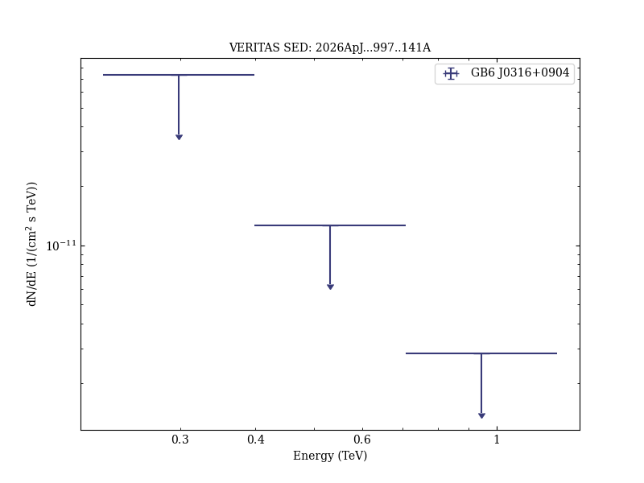
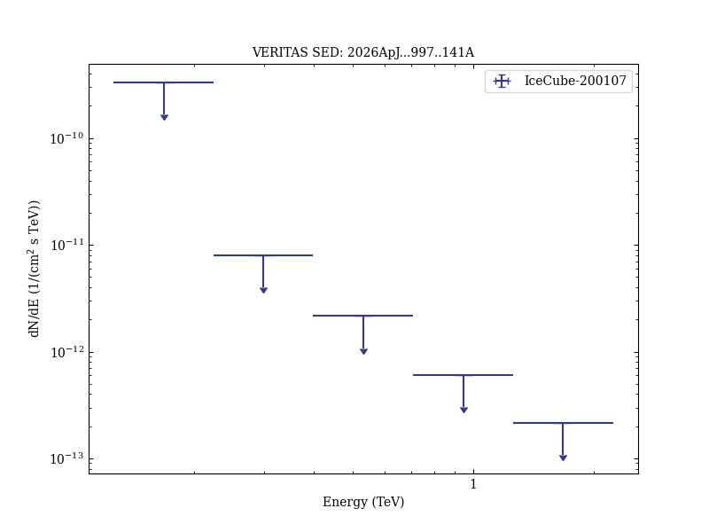

# Prompt Searches for Very-high-energy γ-Ray Counterparts to IceCube Astrophysical Neutrino Alerts

Reference:
Abhir, J. et al. (The VERITAS Collaboration), The Astrophysical Journal, 997, 141 (2026)

- ADS: [2026ApJ...997..141A](http://ui.adsabs.harvard.edu/abs/2026ApJ...997..141A)
- DOI: [10.3847/1538-4357/ae2c4e](https://doi.org/10.3847/1538-4357/ae2c4e)

## IceCube-171106A
### Data files

- observation data: [VER-100226.yaml](VER-100226.yaml)
- spectral data: [VER-100226-sed-1.ecsv](VER-100226-sed-1.ecsv)
- observation data and fit results: [VER-100226.yaml](VER-100226.yaml)

### Figures

## IceCube-191001A
### Data files

- observation data: [VER-100227.yaml](VER-100227.yaml)
- spectral data: [VER-100227-sed-1.ecsv](VER-100227-sed-1.ecsv)
- observation data and fit results: [VER-100227.yaml](VER-100227.yaml)

### Figures

## IceCube-201114A
### Data files

- observation data: [VER-100228.yaml](VER-100228.yaml)
- spectral data: [VER-100228-sed-1.ecsv](VER-100228-sed-1.ecsv)
- observation data and fit results: [VER-100228.yaml](VER-100228.yaml)

### Figures

## GB6 J0316+0904
### Data files

- observation data: [VER-100229.yaml](VER-100229.yaml)
- spectral data: [VER-100229-sed-1.ecsv](VER-100229-sed-1.ecsv)
- observation data and fit results: [VER-100229.yaml](VER-100229.yaml)

### Figures

## IceCube-200107
### Data files

- observation data: [VER-100230.yaml](VER-100230.yaml)
- spectral data: [VER-100230-sed-1.ecsv](VER-100230-sed-1.ecsv)
- observation data and fit results: [VER-100230.yaml](VER-100230.yaml)

### Figures

